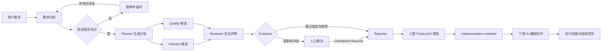

# AgentForge

> 从零散产品需求到可执行 Product/UI 实施包的可恢复多智能体工作流。

AgentForge 让 Planner、Delivery、Quality、Reviewer、Evaluator 和 Reporter 围绕结构化 Artifact 协作，把需求澄清、候选方案、交叉评审、人工裁决、实施报告和运行验收组织成一条可暂停、可恢复、可审计的交付链路。

[](https://github.com/sail0kevin/AgentForge/actions/workflows/ci.yml)


[](LICENSE)

## 从报告到可运行产品

AgentForge 的核心交付物不是一段分析文字，也不是必须二次解释的通用 Prompt，而是包含产品定位、路由、视觉、组件、状态、响应式规则、实施顺序和验收矩阵的完整报告，以及可供下游 AI 编程工具读取的 `implementation-manifest` JSON。

| 企业考勤工作台 | 数字艺术展览 | 数字聆听室 |
|---|---|---|
|  |  |  |
| `/generated/attendance` | `/generated/atelier` | `/generated/nocturne` |
| 数据概览、状态筛选、打卡反馈、移动端导航 | 作品浏览、展览布局、艺术图片资产展示 | 媒介筛选、播放收藏、详情弹层、移动端导航 |

这三个页面依据 AgentForge 报告中的产品定位、视觉方向、路由、组件和交互要求，由开发或 AI 编程协作完成，用于验证报告能够指导不同形态的网站实现。它们是仓库内可运行的报告映射案例，不代表 AgentForge 已经能够自动编译、部署任意网站。

## 30 秒看懂

| 问题 | AgentForge 的回答 |
|---|---|
| 输入是什么 | 零散需求、补充信息、版本化项目文档和受控参考证据 |
| Agent 如何协作 | 使用 `PlanningArtifact`、`Candidate`、`Finding`、`ReportArtifact` 等结构化对象交接，不依赖自然语言互相转发 |
| 最终交付什么 | 三套体现不同取舍的 Product/UI 实施报告、单方案 `implementation-manifest`、Markdown 导出和验收记录 |
| 如何避免错误继续传递 | Schema 校验、引用回查、预算约束、交叉评审、Evaluator 收敛和高影响冲突人工裁决 |
| 如何处理中断 | LangGraph Checkpoint、`interrupt / resume`、节点幂等和持久化人工决策 |
| 如何验证报告能指导实现 | `implementation-manifest`、Baseline/AgentForge 双分支实验包、Playwright 验收、匿名盲评工具，以及三个可运行报告映射案例 |

## 核心工作流



## 关键设计与取舍

| 决策 | 为什么这样选 | 代价与边界 |
|---|---|---|
| LangGraph 图式编排 | 工作流包含追问、并行候选、循环修订和人工等待，图结构比线性链更适合表达状态流转 | 状态 Schema、Checkpoint 和调试复杂度更高 |
| 结构化 Artifact 协作 | 让候选、Finding、引用和验收条件可校验、可持久化、可定向回传 | 需要维护更严格的数据契约和版本兼容 |
| SQLite 默认，PostgreSQL 可切换 | SQLite 适合 local-first 演示；PostgreSQL Checkpointer 用于跨实例恢复和分布式租约场景 | 生产负载、备份恢复和远程环境仍需单独验收 |
| 默认 TF-IDF，可选混合 RAG | 小型本地知识库先保证确定性；向量完整且模型一致时再通过 bge-m3 与 RRF 提升语义召回 | 人工 Golden Set 未完成前不宣称真实 Recall@5 提升 |
| 置信度驱动人工介入 | 只在需求不足或高影响冲突时暂停，减少无意义审批 | 阈值仍需要真实使用数据持续校准 |
| 报告与实施包分层 | Markdown 便于人审，JSON 便于下游 AI 编程工具和自动化流程消费 | 当前下游代码生成、部署和截图采集仍需外部执行 |

## 工程实现

- **可恢复执行**：七节点 LangGraph 工作流支持刷新、中断、人工等待后从同一 thread 恢复，并通过节点幂等减少重复 Artifact。
- **独立候选与 Reflection Loop**：Delivery 和 Quality 分别关注交付效率与工程质量，Reviewer 输出带证据 Finding，Evaluator 决定通过、定向修改或人工确认。
- **证据优先 RAG**：Markdown 按标题路径和真实行号切块，检索结果携带 citation；报告生成前重新校验来源，证据不足时保留未决项。
- **状态与审计**：Prisma 持久化工作流、节点、报告、人工决策和运行反馈，同时记录 Provider、Token、费用和工具调用。
- **租户与凭证隔离**：工作流、报告、文档和 Run 按用户与 Session 隔离，API Key 由服务端加密并只返回掩码。
- **报告验收闭环**：运行证据需包含启动命令、访问地址、截图和验收记录；证据不完整时不会把方案标记为 `accepted`。
- **成本优化**：三层优化机制大幅降低 Token 消耗 — LRU 缓存避免重复分析相似需求，复杂度评分动态调整候选数量（低复杂度单候选节省 25-35% Token），三档预算策略（Minimal/Standard/Thorough）自动配置优化组合（Minimal 可节省约 65% Token）。

## 可复现证据

以下数字均来自仓库已有记录，不把 dry-run、固定夹具或本地演示包装成生产结论。

| 验证项 | 已有结果 | 结论边界 |
|---|---|---|
| 完整质量门禁 | 2026-08-03：`211/211` Unit、`25/25` Core E2E、`1/1` Session E2E；`src/lib/**` 行 `91.55%`、分支 `86.85%`、函数 `89.35%` | 同时通过 TypeScript、ESLint、文档链接检查和生产构建 |
| 报告链路回归 | 完整门禁后新增用例单独通过聚焦 `1/1` 与 Core E2E `26/26` | 使用隔离 SQLite 和预设运行证据，不等于真实网站验收 |
| PostgreSQL Checkpoint | 在 WSL 专用临时 PostgreSQL 库完成 migration、跨实例 crash recovery、多进程租约与 Fencing Token 验收 | 尚未完成目标环境负载、备份恢复、Docker 和远程 CI 复验 |
| RAG 工具链 | 确定性 fixture、仓库检索冒烟、混合检索回退和人工标注工作流已实现 | 人工 Golden Set 当前为 `not_ready`，不能宣称真实 Recall@5、MRR 或 NDCG |
| 多 Agent 消融 | 288/288 完成，4臂对照实验全部运行完成，深度归因已完成（Day 1-3），**质量价值验证已完成（Day 4-5）** | 发现多Agent成本16x但覆盖率降13%；根因：Schema复杂度 × 调用次数 → 累积失败风险；**新增：24个真实场景深度对比，证明Multi-Agent在架构权衡、实施路径、风险管理等维度显著优于单Agent** |
| 报告映射案例 | 三个 Next.js 页面可在本地运行并覆盖桌面端、移动端和核心交互 | 使用本地确定性演示数据，尚无真实用户和生产业务数据 |

完整口径见 [V2 证据基线](<./docs/2026-08-01 - v2-evidence-baseline - V2证据基线.md>)。

## 技术栈

| 层级 | 技术 |
|---|---|
| Web | Next.js 16、React 19、TypeScript 5、Tailwind CSS 4、Zustand |
| Agent | LangGraph、LangChain、结构化输出、SSE |
| Model | Ollama、OpenAI、Anthropic、DeepSeek、OpenAI-compatible Provider |
| Data | Prisma 7、SQLite、PostgreSQL、LangGraph Checkpointer |
| Retrieval | TF-IDF、bge-m3 Embedding、RRF 混合检索、引用回查 |
| Quality | Node Test Runner、Playwright、TypeScript、ESLint、Production Build |

## 快速开始

要求：Node.js LTS、npm。

### 方式一：一键启动（推荐）

```bash
# Windows
git clone https://github.com/sail0kevin/AgentForge.git
cd AgentForge
quick-start.bat

# Mac/Linux
git clone https://github.com/sail0kevin/AgentForge.git
cd AgentForge
./quick-start.sh
```

脚本会自动完成依赖安装、环境配置、数据库初始化并启动服务。

### 方式二：手动安装

```bash
git clone https://github.com/sail0kevin/AgentForge.git
cd AgentForge
npm ci
cp .env.example .env
npm run db:generate
npm run db:migrate
npm run dev
```

Windows PowerShell 使用 `Copy-Item .env.example .env` 创建环境文件。默认访问 `http://localhost:3000`；不配置外部模型 API Key 也可以使用确定性 Baseline 模式体验主流程。

推荐演示顺序：

1. 新建需求，观察需求分析、补充问题和执行计划。
2. 对比 Delivery / Quality 独立候选及交叉评审结果。
3. 提交人工裁决，验证 Checkpoint 恢复。
4. 在报告中心查看三套 Product/UI 报告并下载 `implementation-manifest`。
5. 访问 `/generated/attendance`、`/generated/atelier` 和 `/generated/nocturne` 查看报告映射结果。

详细步骤见[本地演示指南](<./docs/2026-07-19 - local-demo-guide - 本地演示指南.md>)。真实下游 AI 对照实验的配置模板见[`examples/product-ui-implementation-experiment`](<./examples/product-ui-implementation-experiment/README.md>)，完整口径见[Product/UI 实施评测指南](<./docs/2026-08-04 - product-ui-implementation-evaluation - ProductUI实施评测指南.md>)。

## 当前边界

- 三个页面证明报告可以指导下游实现，不代表 AgentForge 已能自动生成、部署和验收任意网站。
- 人工 RAG Golden Set、真实模型盲评、Provider 成本与延迟、生产并发和真实用户效果仍缺独立证据。
- PostgreSQL Checkpointer 已完成专项本地验证，目标环境持久化、备份恢复和生产负载仍待验收。
- Markdown 和 JSON 导出可用；PDF / DOCX 导出、统一 Provider 原生 Tool Calling 和 Electron 生产发布尚未完成。
- GitHub/UI 参考已固定完整 commit SHA，但许可证复用审计仍需在实际使用前完成。

## 核心文档

- [当前开发状态](<./docs/2026-08-01 - current-development-status - 当前开发状态.md>)
- [当前运行架构](<./docs/2026-08-01 - current-runtime-architecture - 当前运行架构.md>)
- [Product/UI 实施包说明](<./docs/2026-08-04 - product-ui-implementation-manifest - AgentForge-implementation-manifest.md>)
- [Product/UI 实施评测指南](<./docs/2026-08-04 - product-ui-implementation-evaluation - ProductUI实施评测指南.md>)
- [下游实施对照实验模板](<./examples/product-ui-implementation-experiment/README.md>)
- [V2 证据基线](<./docs/2026-08-01 - v2-evidence-baseline - V2证据基线.md>)
- [完整文档索引](<./docs/2026-08-01 - document-index - 文档索引.md>)
- [证据链、评估方法与项目价值说明](<./docs/2026-08-06 - evidence-chain-and-evaluation-methodology - 证据链与评估方法.md>)
- **[多Agent协作价值验证](<./docs/multi-agent-validation/README.md>)** - 24个真实场景深度对比，量化证明Multi-Agent在方案质量上的提升

## English Summary

AgentForge is a local-first, recoverable multi-agent workflow that turns product requirements into reviewed Product/UI implementation reports and machine-readable implementation manifests. It combines requirement clarification, independent candidates, evidence-backed review, human approval, checkpoint recovery, persisted artifacts, downstream implementation handoff, and acceptance feedback. Three runnable Next.js cases demonstrate report-to-product mapping; automated website generation, real-model quality gains, and production deployment remain separate validation work.

## License

[MIT](LICENSE)
