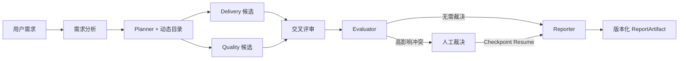

# AgentForge

> 面向开发方案生成的可恢复多智能体工作流平台。
>
> 把需求分析、独立候选、交叉评审、人工裁决和正式报告组织成一条可暂停、可恢复、可审计的工程闭环。

[](https://github.com/sail0kevin/AgentForge/actions/workflows/ci.yml)


[](LICENSE)


AgentForge 是一个 **local-first Web MVP**。它不是把多个聊天框放在一起，而是让不同 Agent 围绕结构化 Artifact 协作：Planner 生成计划，Delivery / Quality 生成独立候选，Reviewer 提交带证据的 Finding，Evaluator 在必要时进入人工裁决，Reporter 最终生成可追溯报告。

## 30 秒看懂这个项目

| 招聘方关心什么 | 项目中的实际实现 |
|---|---|
| 核心难点 | LangGraph 状态图、SQLite Checkpoint、interrupt / resume、节点幂等 |
| Agent 如何协作 | 结构化 PlanningArtifact、Candidate、Finding、ReportArtifact，而不是自然语言互相转发 |
| 如何保证可追溯 | Markdown 标题路径与行号引用、来源清单、风险/未决项、Token/费用/工具审计 |
| 如何验证 | 72/72 Unit、24/24 Core E2E、1/1 Session Isolation E2E、仓库文档检索 6/6 命中 |
| 当前状态 | Web MVP 已形成闭环；真实模型盲评、生产级多实例和 Electron 正式交付仍在推进 |

## 产品体验

| 工作流闭环 | 版本化报告 | 新版统一工作台 |
|---|---|---|
|  |  |  |
| 从规划到人工裁决与报告生成 | 动态目录、来源、风险与版本记录 | 持久任务对话空间、Agent 成员和统一导航 |

## 核心工作流



### 可恢复执行

七节点 LangGraph 工作流将状态写入 SQLite Checkpoint；刷新、中断和人工等待后可从同一 thread 恢复，并通过节点幂等避免重复生成 Artifact。

### 结构化候选与交叉评审

Delivery / Quality 分别生成独立 Candidate，Reviewer 输出带证据的 Finding，Evaluator 负责比较、有限修订和结果收敛。

### 可审计与成本可见

受控只读工具有 Schema、计划授权、超时、次数、大小和调用审计约束；系统同时记录 Token、费用、Provider 和 ToolInvocation。

### 凭证与数据隔离

工作流、报告、文档、计划和 Run 按用户与 Session 隔离，API Key 在服务端加密并只返回掩码。

### 证据优先

Markdown 文档按 H1–H6 标题路径和真实行号切块，检索结果带 citation；报告生成前会重新校验来源。

## 技术栈

| 层级 | 技术 |
|---|---|
| Web | Next.js 16、React 19、TypeScript 5、Tailwind CSS 4、Zustand |
| Agent / Workflow | LangGraph、LangChain、结构化输出、SSE |
| Model | Ollama、OpenAI、Anthropic、DeepSeek、OpenAI-compatible Provider |
| Data | Prisma 7、SQLite；提供 PostgreSQL Schema |
| Retrieval | 轻量 TF-IDF、文档分块、来源引用 |
| Quality | Node Test Runner、Playwright、ESLint、TypeScript、Production Build |
| Desktop | Electron 43 实验性入口与打包配置 |

## 可复现的质量证据

最近一次 `npm run quality:all` 会串联以下门禁；数字以本文档收口后的最终复跑结果为准：

```text
Unit tests                 72 / 72
Core Playwright E2E        24 / 24
Session isolation E2E       1 / 1
TypeScript / ESLint / Build passed
```

```bash
npm run quality:all
```

### RAG 离线回归

- `npm run quality:rag:baseline`：12 类固定检索意图，分别验证无噪声 `k=1` 与共享噪声 `k=5` 的 Recall、MRR、无关结果率和引用完整率。这是确定性夹具，只证明检索与引用指标实现。
- `npm run quality:rag:repository`：读取 `README.md` 与当前开发状态文档，按标题路径和真实行号生成项目文档 Chunk，验证 6 个检索意图是否命中目标章节；任一未命中即以非零退出码阻断门禁。最终 Chunk 数和命中数见下方“最新验证结果”。

这些结果不是通用检索准确率，也不是模型语义质量结论。当前 RAG 仍是 TF-IDF，没有使用 Embedding、RRF 或向量数据库。

### 真实模型盲评工具链

已冻结 **12 个需求案例**（网站、管理后台、学习场景各 4 个）与 **5 种协作变体**，确定性生成 **12 × 5 = 60 个唯一运行任务**。工具链支持清单哈希、运行计划、真实输入预检、匿名评分包、私有解盲映射、每名评分者的独立模板和解盲汇总。

`npm run quality:blind:dry-run` 会使用 `synthetic: true`、`modelCalled: false` 的合成数据贯通 60 项运行和 2 名合成评分者，只验证链路连通性。当前尚未完成 60 次真实模型运行，也没有至少 2 名独立评分者的真实评分，因此不得声称多 Agent 质量提升、幻觉下降或成本下降。

### 最新验证结果

2026-07-19 在当前工作区完整运行 `npm run quality:all`，最终退出码为 `0`：

- 固定检索夹具：12 类意图；无噪声 `k=1` 与共享噪声 `k=5` 的 Recall、MRR、引用完整率均为 `1`；共享噪声无关结果率为 `0.5862068965517241`。
- 仓库文档检索：2份真实项目文档生成 **31个Chunk**，6个检索意图 **6/6命中目标章节**。
- 盲评工具链：12 个冻结案例、5 种变体、60 项运行计划；合成 dry-run 贯通 60 项运行和 2 名合成评分者，未调用模型。
- 自动化验证：**72/72 Unit、24/24 Core E2E、1/1 Session Isolation E2E**；TypeScript、ESLint 与 Production Build 通过。

以上是当前工作区的离线工程门禁结果，不是公开在线服务、真实模型盲评或多 Agent 质量收益结论。

## 三分钟本地演示

1. 启动项目并进入工作台；不配置 API Key 也可以选择确定性 Baseline 模式。
2. 新建开发报告需求，查看 Requirement Analysis、Execution Plan 和动态目录。
3. 对比 Delivery / Quality 两个独立候选及交叉评审结果。
4. 在高影响冲突处提交人工裁决，观察工作流从 Checkpoint 恢复。
5. 打开报告中心，检查来源、风险、未决项、成本和版本记录，并导出 Markdown。

完整步骤见[本地演示指南](<docs/demo - 本地演示指南.md>)。

## 快速开始

要求：Node.js LTS、npm。

```bash
git clone https://github.com/sail0kevin/AgentForge.git
cd AgentForge
npm ci
cp .env.example .env          # macOS、Linux、Git Bash
npm run db:generate
npm run db:migrate
npm run dev
```

Windows PowerShell可将环境文件复制命令替换为：

```powershell
Copy-Item .env.example .env
```

访问 `http://localhost:3000`。模型 Provider、认证模式和数据库配置见 `.env.example` 与[本地演示指南](<docs/demo - 本地演示指南.md>)。

## 当前边界

- RAG 当前是轻量 TF-IDF，不应表述为 Embedding / 向量检索 / RRF。
- 已有受控只读工具，但尚未完成统一的 Provider 原生 Tool Calling 接入。
- Checkpoint 当前使用本地 SQLite，尚未验证多实例共享 Checkpointer。
- Markdown 导出可用，PDF / DOCX 导出尚未完成。
- Electron 为实验性入口，尚未完成代码签名、安装后迁移和干净机器验收。
- 真实模型盲评尚未完成；当前没有“质量提升 X%”“幻觉下降 X%”等结论。

## 文档

- [文档索引](<docs/README - 文档索引.md>)
- [当前运行架构](<docs/architecture - 当前运行架构.md>)
- [当前开发状态](<docs/current-status - 当前开发状态.md>)
- [质量评测说明](<docs/quality - 质量评测/README - 质量评测说明.md>)
- [当前项目报告](<docs/reports - 对外发布报告/project-report - 当前项目报告.md>)
- [本地演示指南](<docs/demo - 本地演示指南.md>)
- [截图说明](docs/screenshots/README.md)
- [安全策略](SECURITY.md)

## English summary

AgentForge is a local-first Web MVP for evidence-backed development reports. It combines structured planning, independent delivery and quality candidates, cross-review, human approval, checkpoint recovery, immutable report versions, controlled tools, cost auditing, and user/session isolation. Real-model evaluation and production-grade desktop delivery remain roadmap items.

## License

[MIT](LICENSE)
