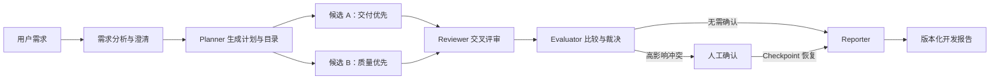
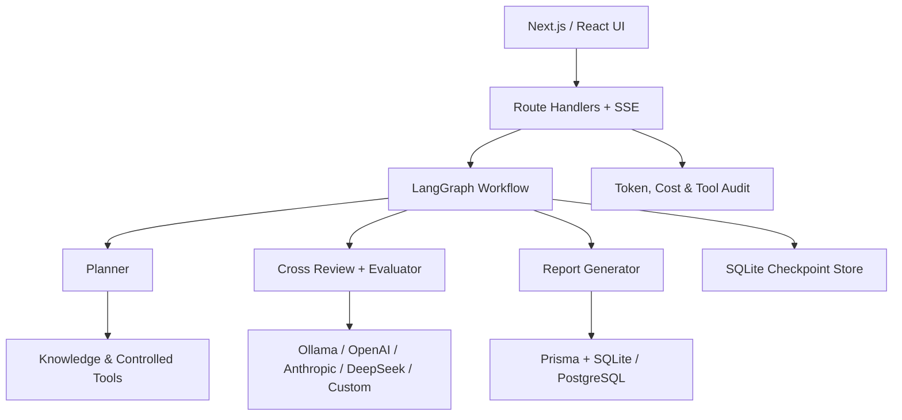

# AgentForge

> 面向开发报告生成的可恢复多智能体工作流平台<br />
> A recoverable multi-agent workflow for evidence-backed development reports.

[](https://github.com/sail0kevin/AgentForge/actions/workflows/ci.yml)
[](LICENSE)
[](https://nextjs.org/)
[](https://www.electronjs.org/)

AgentForge 不是把多个聊天机器人放在同一个页面里，而是把需求分析、方案生成、交叉评审、人工裁决和正式报告组织成一条可暂停、可恢复、可审计的工程工作流。

用户可以先用不消耗 API Key 的确定性基线完整体验流程，再接入 Ollama、OpenAI、Anthropic、DeepSeek 或 OpenAI-compatible 模型运行真实多智能体任务。


## 为什么做这个项目

直接让单个模型生成长篇开发报告，常见问题是需求遗漏、结论缺少依据、模型自己写又自己审、失败后只能重跑，以及无法解释费用和执行过程。

AgentForge 将这些问题拆成明确的工程对象：

- `PlanningArtifact`：需求分析、执行计划和动态报告目录；
- `ReviewWorkflow`：两个隔离候选、结构化 Finding、Reviewer 与 Evaluator；
- `DevelopmentWorkflow`：七节点 LangGraph、Checkpoint、暂停与故障恢复；
- `ReportArtifact`：有版本、有来源清单、可重新验证和导出的最终报告；
- `ToolInvocation` / `TokenUsage`：工具审计、Token 与成本记录。

## 三分钟演示

不配置模型、不填写 API Key 也可以体验核心状态机：

1. 启动项目并进入 **开发工作流**；
2. 点击 **填入演示需求**，保留 **确定性基线**；
3. 点击 **分析并执行**，查看七节点时间线和 Artifact 链；
4. Evaluator 遇到高影响取舍后，工作流会安全暂停；
5. 选择 **混合方案**，填写裁决说明并点击 **从 Checkpoint 恢复**；
6. 打开 **报告中心**，查看动态目录、风险、来源和最终决策；
7. 导出 Markdown，刷新页面验证工作流和报告仍然存在。

推荐演示需求：

```text
为大学运营团队建设内容管理后台，需要角色权限、审核流程、操作审计、可访问性和分阶段交付。
```

完整讲解见 [本地演示指南](<docs/demo - 本地演示指南.md>)。

## 工作流



工作流节点通过幂等键和 Checkpoint 保存。模型超时、页面刷新或人工暂停后，可以从最近状态继续，不重复写入已经完成的 Artifact。

## 核心能力

- **多智能体协作**：Planner、双候选、Reviewer、Evaluator 和 Reporter 分工执行；
- **人工在环**：关键信息不足或候选存在高影响冲突时安全暂停；
- **可恢复执行**：LangGraph Checkpoint、节点幂等、租约和故障恢复；
- **证据优先报告**：知识分块、来源版本、行号引用、来源清单和导出前复验；
- **受控工具**：Schema 校验、授权、调用次数、超时、幂等和审计记录；
- **凭证安全**：API Key 使用 AES-256-GCM 加密，前端只接收掩码和长度；
- **成本治理**：记录输入/输出 Token、美元/人民币成本和工作流预算；
- **双运行模式**：确定性基线用于稳定演示，真实模型用于语义质量实验；
- **桌面应用**：Electron 自动初始化 SQLite、数据库迁移和本机加密密钥。

## 技术架构



| 层级 | 技术 |
|---|---|
| 前端 | Next.js 16、React 19、TypeScript、Tailwind CSS、Zustand |
| 工作流 | LangGraph、LangChain、结构化输出、Checkpoint |
| 数据 | Prisma、SQLite、PostgreSQL Schema、better-sqlite3 |
| 模型 | Ollama、OpenAI、Anthropic、DeepSeek、自定义兼容接口 |
| 桌面端 | Electron 43、electron-builder、NSIS |
| 质量 | Node Test Runner、Playwright、ESLint、GitHub Actions |

## 快速开始

要求：Node.js 22+、npm。

```bash
git clone https://github.com/sail0kevin/AgentForge.git
cd AgentForge
npm ci
cp .env.example .env
npm run db:generate
npm run db:migrate
npm run dev
```

Windows PowerShell：

```powershell
Copy-Item .env.example .env
```

打开 [http://localhost:3000](http://localhost:3000)。本地演示保留：

```env
APP_AUTH_MODE="local"
DATABASE_URL="file:./prisma/dev.db"
```

### 可选：Ollama 真实模型演示

```bash
ollama pull qwen2.5:3b
ollama serve
```

然后在 Agent 页面创建 Ollama Agent，模型填写 `qwen2.5:3b`，地址填写 `http://localhost:11434`。

## 质量验证

```bash
npm run security:verify-secrets
npm run lint
npm run typecheck
npm run test:unit
npm run test:e2e:core
npm run test:e2e:session
npm run build
```

当前本地基线：

- 单元测试：62/62；
- 核心 E2E：24/24；
- Session 隔离 E2E：1/1；
- ESLint、TypeScript 和 production build 通过；
- GitHub Actions 自动执行密钥卫生、Lint、类型、单元测试和构建检查。

## 安全边界

- 不提交 `.env`、SQLite 数据库、日志、测试产物或真实 API Key；
- Web 生产模式禁止使用本地免认证模式，并要求至少 32 字符的会话和加密密钥；
- Electron 首次启动自动生成持久的本机会话密钥和加密主密钥；
- 公网部署拦截指向本机或私网的 Provider URL，桌面应用保留 Ollama 能力；
- Windows 安装包当前未购买代码签名证书，可能触发 SmartScreen 提示。

详见 [Security Policy](SECURITY.md)。

## 桌面打包

```bash
npm run electron:build:win
```

生成的 `dist-electron/` 不提交到 Git；正式安装包应作为 GitHub Release Asset 发布。

## 项目结构

```text
src/app/api/       API、认证、工作流、报告与工具入口
src/components/    工作台、开发工作流和报告中心
src/lib/planner/   需求分析、结构化计划和语义校验
src/lib/review/    双候选、交叉评审和质量评价
src/lib/report/    报告契约、来源复验和 Markdown 导出
src/lib/workflow/  LangGraph 节点、Checkpoint 和恢复逻辑
src/lib/rag/       文档分块、检索和来源元数据
prisma/            SQLite/PostgreSQL Schema 与迁移
e2e/               核心 API 和用户隔离测试
electron/          Windows/macOS/Linux 桌面入口
docs/              架构、设计、质量和工程报告
```

## 当前状态与诚实边界

这是一个用于学习、求职展示和继续研究的本地优先 MVP，不是已经完成安全审计的公网 SaaS。

已经完成：结构化规划、知识工具、双候选交叉评审、人工确认、动态报告、Checkpoint 恢复、API Key 加密、测试体系和 Windows 安装包。

尚未作为完成项宣称：PDF/DOCX 导出、Provider 原生 Tool Calling、多实例共享 Checkpointer、正式代码签名，以及真实模型加独立评分者的完整盲评结论。

## 文档

- [文档索引](<docs/README - 文档索引.md>)
- [当前运行架构](<docs/architecture - 当前运行架构.md>)
- [产品设计总入口](<docs/design - 产品设计方案/README - 设计文档总入口.md>)
- [当前项目报告](<docs/reports - 对外发布报告/project-report - 当前项目报告.md>)
- [质量评测说明](<docs/quality - 质量评测/README - 质量评测说明.md>)
- [发布检查清单](<docs/reports - 对外发布报告/publishing-checklist - 发布检查清单.md>)
- [贡献说明](CONTRIBUTING.md)

## English summary

AgentForge is a local-first, recoverable multi-agent platform for generating evidence-backed development reports. It separates planning, independent candidate generation, cross-review, evaluation, human approval, and report generation into versioned artifacts connected by a checkpointed LangGraph workflow. A deterministic baseline demonstrates the complete state machine without an API key; real providers can be connected for model-quality experiments.

## License

[MIT](LICENSE)
