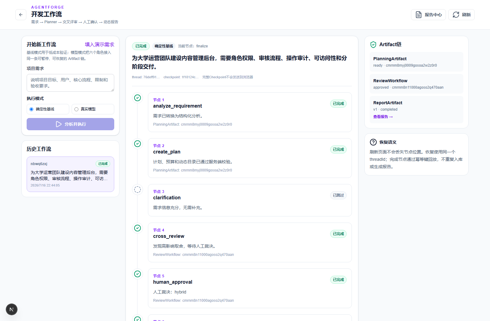
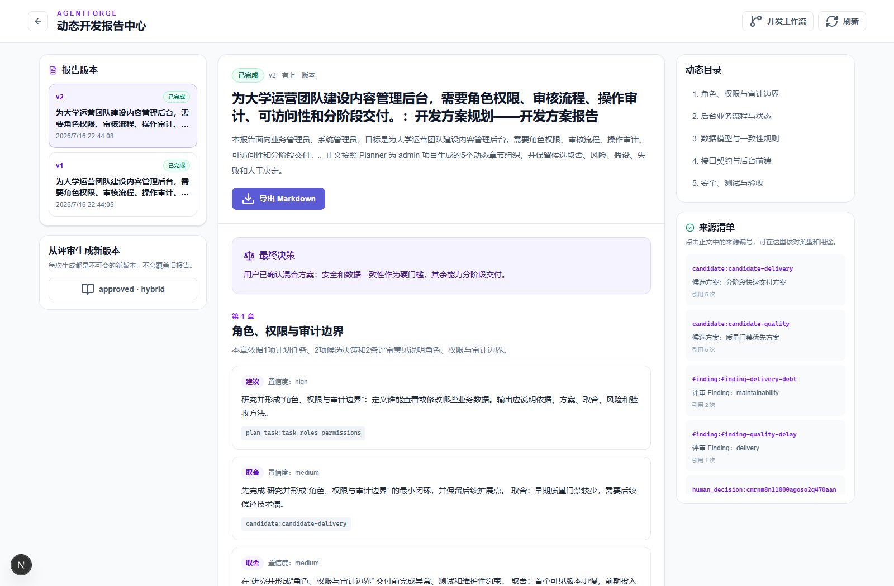
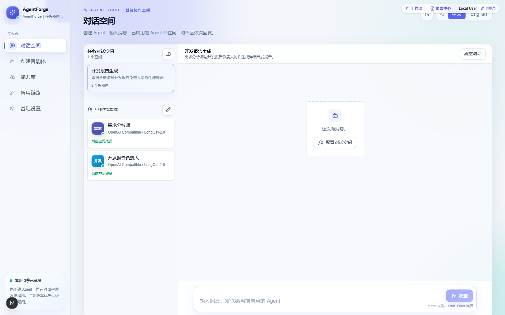
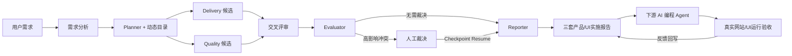

# AgentForge

> 面向“需求到产品/UI实施报告”的可恢复多智能体工作流平台。
>
> 把需求澄清、多套产品/UI方案、交叉评审、人工裁决、下游 AI 编程 Prompt 和真实验收反馈组织成一条可暂停、可恢复、可审计的交付闭环。

[](https://github.com/sail0kevin/AgentForge/actions/workflows/ci.yml)


[](LICENSE)



AgentForge 是一个 **local-first Web MVP**，目标是把零散产品需求转成可交给下游 AI 编程 Agent 的多套完整产品/UI实施报告。它不是把多个聊天框放在一起，而是让不同 Agent 围绕结构化 Artifact 协作：Planner 先澄清需求，Delivery / Quality 生成独立候选，Reviewer 提交带证据的 Finding，Evaluator 在必要时进入人工裁决，Reporter 最终生成体验优先、视觉优先和工程优先三套报告；用户可以导出 Markdown、复制下游 Prompt，并在网站真实运行后回写验收结果。

## 30 秒看懂这个项目

| 招聘方关心什么 | 项目中的实际实现 |
|---|---|
| 核心难点 | LangGraph 状态图、可切换 SQLite/PostgreSQL Checkpoint、interrupt / resume、节点幂等 |
| Agent 如何协作 | 结构化 PlanningArtifact、Candidate、Finding、ReportArtifact，而不是自然语言互相转发 |
| 如何保证可追溯 | Markdown 标题路径与行号引用、来源清单、风险/未决项、Token/费用/工具审计 |
| 如何验证 | 单元/E2E、RAG Golden Set、冻结消融协议与专用 PostgreSQL 集成测试入口 |
| 当前状态 | 产品/UI报告生成、持久化、导出和验收反馈链路已实现；真实网站由下游 AI Agent 生成，GitHub 证据冻结和真实模型质量仍需单独验证 |

## 产品体验

| 工作流闭环 | 版本化报告 | 新版统一工作台 |
|---|---|---|
|  |  |  |
| 从规划到人工裁决与报告生成 | 动态目录、来源、风险与版本记录 | 持久任务对话空间、Agent 成员和统一导航 |

## 核心工作流



### 可恢复执行

七节点 LangGraph 工作流默认写入 SQLite Checkpoint，也可切换到 PostgreSQL；刷新、中断和人工等待后可从同一 thread 恢复，并通过节点幂等避免重复生成 Artifact。

### 结构化候选与交叉评审

Delivery / Quality 分别生成独立 Candidate，Reviewer 输出带证据的 Finding，Evaluator 负责比较、有限修订和结果收敛。

### 可审计与成本可见

受控只读工具有 Schema、计划授权、超时、次数、大小和调用审计约束；系统同时记录 Token、费用、Provider 和 ToolInvocation。

### 凭证与数据隔离

工作流、报告、文档、计划和 Run 按用户与 Session 隔离，API Key 在服务端加密并只返回掩码。

### 证据优先

Markdown 文档按 H1–H6 标题路径和真实行号切块，检索结果带 citation；报告生成前会重新校验来源。

## 技术栈

| 层级 | 技术 |
|---|---|
| Web | Next.js 16、React 19、TypeScript 5、Tailwind CSS 4、Zustand |
| Agent / Workflow | LangGraph、LangChain、结构化输出、SSE |
| Model | Ollama、OpenAI、Anthropic、DeepSeek、OpenAI-compatible Provider |
| Data | Prisma 7、SQLite 默认后端、PostgreSQL 应用 schema / migration、可切换 LangGraph Checkpointer |
| Retrieval | 默认 TF-IDF；可选 bge-m3 Embedding + RRF 混合检索、文档分块、来源引用 |
| Quality | Node Test Runner、Playwright、ESLint、TypeScript、Production Build |
| Desktop | Electron 43 实验性入口与打包配置 |

## 可复现的质量证据

### 当前可信基线（2026-08-01）

- 当前状态以 2026-08-02 工作区代码和本轮聚焦验证为准；历史页面中的 2026-07-19、2026-08-01 结果仍仅代表各自日期的发布或门禁快照。
- `WORKFLOW_CHECKPOINT_BACKEND=postgres` 已可启用 `PostgresSaver`，SQLite 仍是默认本地后端；2026-08-01 已在 WSL 随机专用临时 PostgreSQL 库完成三条 migration、跨实例 crash recovery 和多进程租约 / Fencing Token 验收，且测试资源已清理。Docker/CI 仍是待补充的独立环境证据；这不构成生产负载、队列、exactly-once 或多地域验收。
- **已实现**：默认 TF-IDF 检索；设置 `RAG_EMBEDDINGS_ENABLED=true` 后，上传会在文档主事务成功后尝试持久化 bge-m3 向量，只有语料向量同模型、同维度且完整时才使用 RRF 混合检索，否则确定性回退到 TF-IDF。
- **已验证**：12 条确定性 fixture 的 Golden Gate 覆盖 clean `Recall@1`、shared-noise `Recall@5` 与 `NDCG@10`，当前均为 1.0。它验证 fixture 的 TF-IDF 回归，不是 bge-m3 或生产知识库的召回提升结论。
- **待实测**：本地 Ollama/bge-m3 实际调用、既有文档向量回填、多来源人工标注 Golden Set 以及 RRF 参数比较。
- 已完成 24 条真实 LongCat-2.0 的单 Agent / 完整多 Agent 对比：单 Agent 覆盖率 99.3%，完整多 Agent 覆盖率 86.2%。这是关键词 checklist 的探索性结果，存在模型波动，不能用于声称任一方案的质量提升。
- 2026-08-02 本轮聚焦验证通过：`208/208` Unit、`npm run db:validate`、`npm run db:validate:postgres`、TypeScript、ESLint 和生产构建；本轮未运行完整 E2E、真实 Provider 或数据库持久化集成测试。此前 2026-08-01 的 `quality:all` 结果仍保留为历史全门禁快照，不与本轮结果混写。四臂消融实验的 480 条记录仍是无模型 preflight，实际外部支出为 `$0`，不是质量实验结论。授权模板生成器的 `pending` 文件也不是外部费用审批。

最近一次 `npm run quality:all` 会串联以下门禁；数字以本文档收口后的最终复跑结果为准：

```text
Unit tests                193 / 193 (2026-08-01 full gate)
Core Playwright E2E        24 / 24
Session isolation E2E       1 / 1
TypeScript / ESLint / Build passed
```

```bash
npm run quality:all
```

### RAG 离线回归

- `npm run quality:rag:baseline`：12 类固定检索意图，分别验证无噪声 `k=1` 与共享噪声 `k=5` 的 Recall、MRR、无关结果率和引用完整率。这是确定性夹具，只证明检索与引用指标实现。
- `npm run quality:rag:repository`：读取 `README.md` 与当前开发状态文档，按标题路径和真实行号生成项目文档 Chunk，验证 6 个检索意图是否命中目标章节；任一未命中即以非零退出码阻断门禁。最终 Chunk 数和命中数见下方“最新验证结果”。

这些结果不是通用检索准确率，也不是模型语义质量结论。2026-07-19 的发布快照当时仅覆盖 TF-IDF；当前工作区已有受控的 Embedding 与 RRF 运行时路径，可信边界见上方“当前可信基线”。

### 真实模型盲评工具链

已冻结 **12 个需求案例**（网站、管理后台、学习场景各 4 个）与 **5 种协作变体**，确定性生成 **12 × 5 = 60 个唯一运行任务**。工具链支持清单哈希、运行计划、真实输入预检、匿名评分包、私有解盲映射、每名评分者的独立模板和解盲汇总。

`npm run quality:blind:dry-run` 会使用 `synthetic: true`、`modelCalled: false` 的合成数据贯通 60 项运行和 2 名合成评分者，只验证链路连通性。当前尚未完成 60 次真实模型运行，也没有至少 2 名独立评分者的真实评分，因此不得声称多 Agent 质量提升、幻觉下降或成本下降。

### 最新验证结果

2026-08-01 在当前工作区完整运行 `npm run quality:all`，最终退出码为 `0`：

- 固定检索夹具：12 类意图；无噪声 `k=1` 与共享噪声 `k=5` 的 Recall、MRR、引用完整率均为 `1`；共享噪声无关结果率为 `0.5862068965517241`。
- 仓库文档检索：2份真实项目文档生成 **31个Chunk**，6个检索意图 **6/6命中目标章节**。
- 盲评工具链：12 个冻结案例、5 种变体、60 项运行计划；合成 dry-run 贯通 60 项运行和 2 名合成评分者，未调用模型。
- 自动化验证：**193/193 Unit、24/24 Core E2E、1/1 Session Isolation E2E**；`src/lib/**` 覆盖率为行 `92.30%`、分支 `87.62%`、函数 `89.49%`；TypeScript、ESLint 与生产构建通过。核心与 Session E2E 使用并在结束后清理专用 `.next-e2e` 构建目录，避免 Playwright 的 `next dev` 产物污染后续类型检查。

以上是当前工作区的离线工程门禁结果，不是公开在线服务、真实模型盲评或多 Agent 质量收益结论。

## 三分钟本地演示

1. 启动项目并进入工作台；不配置 API Key 也可以选择确定性 Baseline 模式。
2. 新建开发报告需求，查看 Requirement Analysis、Execution Plan 和动态目录。
3. 对比体验优先、视觉优先和工程优先三套产品/UI方案及交叉评审结果。
4. 在高影响冲突处提交人工裁决，观察工作流从 Checkpoint 恢复。
5. 打开报告中心，检查三套产品/UI实施报告、GitHub/UI参考证据、下游 Prompt，导出 Markdown；网站真实运行后可回写通过或需修改。

完整步骤见[本地演示指南](<./docs/2026-07-19 - local-demo-guide - 本地演示指南.md>)。

## 快速开始

要求：Node.js LTS、npm。

```bash
git clone https://github.com/sail0kevin/AgentForge.git
cd AgentForge
npm ci
cp .env.example .env          # macOS、Linux、Git Bash
npm run db:generate
npm run db:migrate
npm run dev
```

Windows PowerShell可将环境文件复制命令替换为：

```powershell
Copy-Item .env.example .env
```

访问 `http://localhost:3000`。模型 Provider、认证模式和数据库配置见 `.env.example` 与[本地演示指南](<./docs/2026-07-19 - local-demo-guide - 本地演示指南.md>)。

## 当前边界

- Hybrid RAG 是 opt-in 路径，仍待本地 Ollama、既有文档向量回填和人工标注知识库实测；12 条满分 fixture 没有区分性，在扩大 Golden Set 前不应表述为“召回率提升 X%”。
- 已有受控只读工具，但尚未完成统一的 Provider 原生 Tool Calling 接入。
- SQLite 是默认 Checkpoint 后端；PostgreSQL Checkpointer 的跨实例恢复与租约 / Fencing 已在 WSL 专用临时库完成实测。Docker/CI 环境复验、生产负载、后台队列与 exactly-once 语义仍不在已验证范围内。
- Markdown 导出可用，PDF / DOCX 导出尚未完成。
- Electron 为实验性入口，尚未完成代码签名、安装后迁移和干净机器验收。
- 真实模型盲评尚未完成；当前没有“质量提升 X%”“幻觉下降 X%”等结论。

## 文档

- [文档索引](<./docs/2026-08-01 - document-index - 文档索引.md>)
- [当前运行架构](<./docs/2026-08-01 - current-runtime-architecture - 当前运行架构.md>)
- [当前开发状态](<./docs/2026-08-01 - current-development-status - 当前开发状态.md>)
- [质量评测说明](<./docs/quality - 质量评测/2026-08-01 - quality-evaluation-index - 质量评测说明.md>)
- [当前项目报告](<./docs/reports - 对外发布报告/2026-07-19 - project-report - 当前项目报告.md>)
- [本地演示指南](<./docs/2026-07-19 - local-demo-guide - 本地演示指南.md>)
- [截图说明](./docs/screenshots/2026-07-19 - screenshot-index - 公开截图说明.md)
- [安全策略](SECURITY.md)

## English summary

AgentForge is a local-first Web MVP for turning product requirements into evidence-aware product/UI implementation report sets. It combines requirement clarification, independent candidate generation, cross-review, human approval, checkpoint recovery, persisted report groups, downstream coding-agent prompts, Markdown export, and post-run acceptance feedback. The generated website is produced by a downstream AI coding agent; GitHub evidence verification, real-model quality evaluation, and production-grade deployment remain separate validation work.

## License

[MIT](LICENSE)
