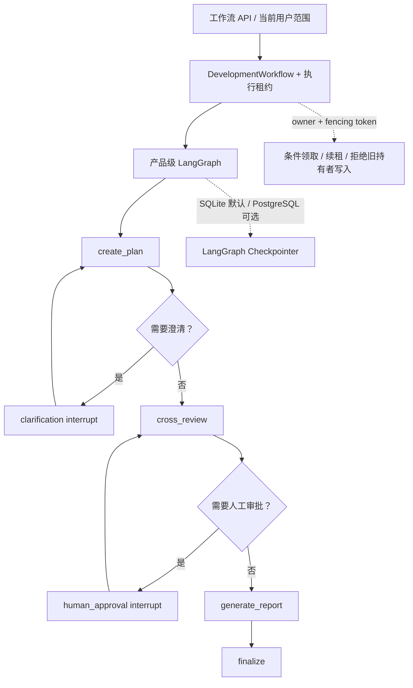
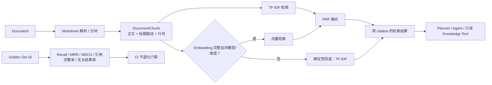
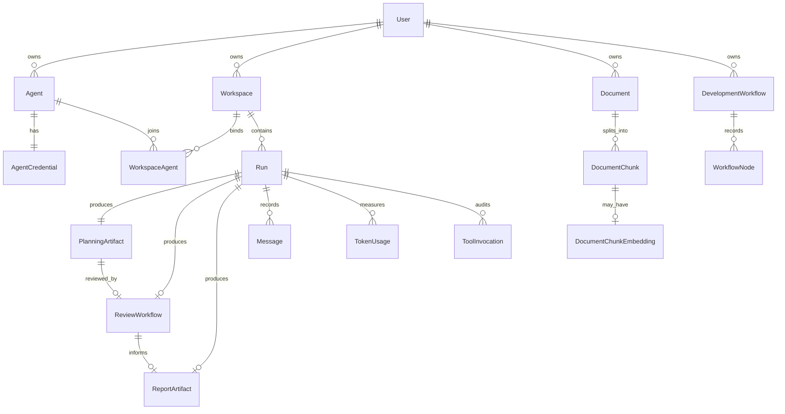
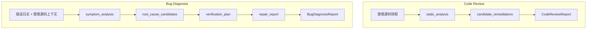

# AgentForge V2 工作流、检索与数据关系

更新时间：2026-08-02（Asia/Shanghai）

本文用图说明当前工作区中可追溯的核心关系，供架构沟通和面试复盘使用。
图中的 **已实现** 仅表示代码已进入当前工作区；真实 Provider 质量、生产负载和远程 CI 回传必须以独立证据为准。完整状态见 [V2 Evidence Baseline](./2026-08-01 - v2-evidence-baseline - V2证据基线.md)。

## 1. 产品级 StateGraph

**已实现：** 需求规划主链使用产品级 LangGraph，支持 clarification 和 human approval interrupt，以及可切换的 SQLite/PostgreSQL checkpoint 后端。

**已实现：** `PostgresSaver`、分布式 lease 与 fencing token，以及专用数据库的 WSL 集成验收。

**待实测：** 当前提交对应 Docker Compose 和 GitHub Actions PostgreSQL job 的远程成功回传。

**目标设计：** 后台队列、exactly-once、Outbox、多地域容灾和生产负载模型不属于当前已验证范围。

## 2. RAG 检索与评测

**已实现：** 文档由服务端切块并保存元数据；默认 TF-IDF 可用。只有 embedding 模型、维度和完整覆盖都满足时，才以 RRF 融合关键词与向量结果，否则确定性退回 TF-IDF。

**已验证：** Golden Set v0 是 12 条冻结 fixture 的回归门禁，不能表示真实知识库的通用召回质量。

**待实测：** 至少 100 条、双人审核、多来源人工 Golden Set 上的 TF-IDF、Embedding 和 Hybrid 对比，以及依据该数据进行的 RRF 调优。

## 3. 业务数据关系

**已实现：** SQLite 与 PostgreSQL Prisma schema 保持同一产品实体结构；下图省略普通字段，只表达核心引用方向。

Checkpoint 表由 LangGraph `SqliteSaver` 或 `PostgresSaver` 独立管理，因此没有画入 Prisma 业务实体图。浏览器不读取完整 checkpoint，而是读取经过 API 范围校验后的业务节点与安全状态。

## 4. 扩展场景基线

**已实现：** 两条独立的确定性 `StateGraph` 基线验证框架可复用性，但尚未进入主链持久化与审批契约。

Code Review 仅对少量文本模式给出带行号的 Finding；Bug Diagnosis 仅将直接日志匹配输出为待验证候选。两者均不执行代码、不调用 Provider、不声称真实代码质量或根因已经证明。

**目标设计：** 在单独定义场景契约、权限、持久化、审批和 UI 后，再考虑将它们接入产品主链。

## 5. CI 质量门禁

**已实现：** GitHub Actions 的 `quality` job 执行密钥卫生检查、lint、类型检查、单元测试、`src/lib/**` 覆盖率（行/分支/函数各 `>=80%`）、RAG Golden Set 和 production build。`postgres-workflow-integration` job 使用临时 PostgreSQL 16 service，部署迁移后执行 Checkpoint 恢复与租约 fencing 集成测试。

**已验证（本地，2026-08-03 最新完整门禁）：** 覆盖率门禁实测为行 `91.55%`、分支 `86.85%`、函数 `89.35%`；该范围不含前端、API route、脚本、E2E、Provider 或生产运行时。

**待实测：** 当前提交的远程 GitHub Actions 成功回传，以及由代码托管平台实际设置为合并保护规则的状态。
