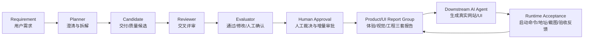
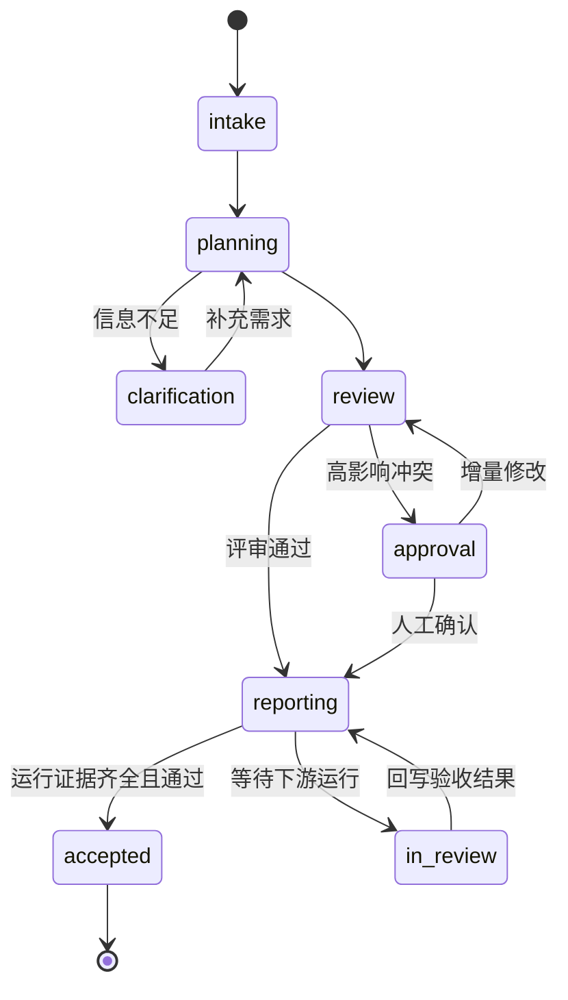
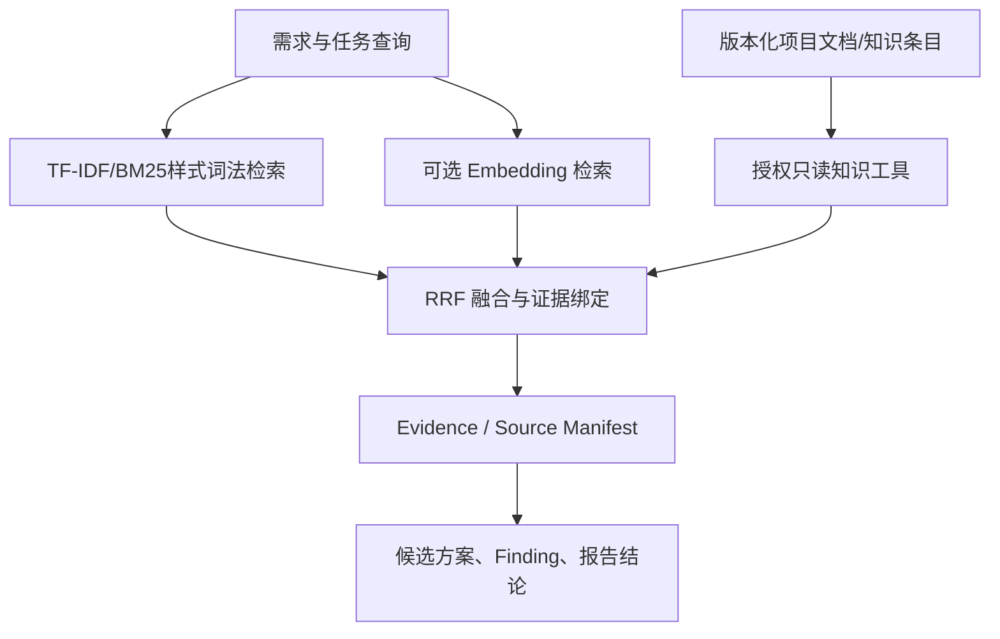
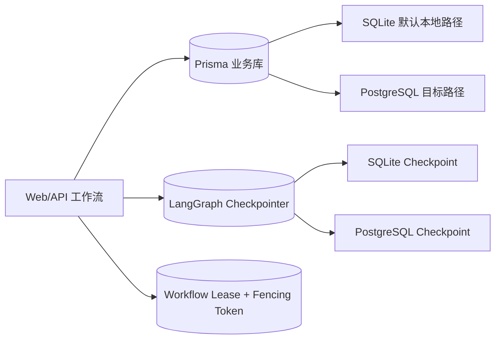
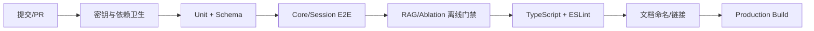

# AgentForge 架构总览
<!-- 文件名：2026-08-02 - architecture-overview - 架构总览 -->

更新时间：2026-08-03（Asia/Shanghai）

## 文档定位

本文档是当前实现与后续演进的架构入口。文中使用以下状态区分事实边界：

- **已实现**：当前代码、数据模型或脚本已经提供该能力。
- **已验证**：有自动测试或可复现的本地/临时环境证据支持该能力。
- **目标设计**：架构允许继续演进，但不代表功能已经交付。
- **待实测**：需要真实 Provider、真实用户、目标基础设施或下游网站运行结果才能确认。

## 产品交付主链路

**已实现**：Planner、候选方案、Reviewer、Evaluator、人工审批、三套产品/UI报告、报告导出、下游 Prompt 和运行验收反馈回写。
**目标设计 / 待实测**：下游 AI 根据报告生成真实网站，以及真实网站的视觉、响应式和交互质量。

## LangGraph 状态与恢复

Checkpoint 保存可恢复状态，`threadId`/工作流标识用于恢复同一执行上下文。当前默认本地业务库和 Checkpoint 路径是 SQLite；PostgreSQL Checkpointer、migration、租约和 Fencing Token 已实现并在 WSL 专用临时库完成验收。**目标设计**是将其部署到目标生产环境并完成备份恢复、故障演练和负载验证。

## 证据与检索链

**已实现**：版本化知识检索、TF-IDF、可选 Embedding、RRF 融合、来源清单和报告结论绑定。
**已验证**：确定性 fixture 回归和离线 Golden Set 工具链边界。
**待实测**：人工 Golden Set 完成后的真实 Recall@5、MRR、NDCG、语义错误率和生产语料表现。

## 持久化、Checkpoint 与租约

业务数据保存用户、工作流、产物、报告和反馈；Checkpoint 保存可恢复执行状态；Lease/Fencing 限制同一工作流的并发写入。三者职责不同，不能把业务库记录等同于 Checkpoint，也不能把租约等同于 exactly-once。**目标设计**仍包括后台队列、exactly-once 语义、多地域部署和生产级故障恢复。

## CI 与质量门控

**已实现**：本地 `quality:all` 和 GitHub Actions CI 质量门控。
**已验证（2026-08-03 最新完整门禁）**：`211/211` Unit、`25/25` Core E2E、`1/1` Session E2E、类型检查、ESLint、51 份 Markdown 文档检查、生产构建，以及 `src/lib/**` 覆盖率行 `91.55%` / 分支 `86.85%` / 函数 `89.35%`。
**待实测**：Docker、远程 CI 回传、目标环境 PostgreSQL、生产负载、备份恢复和真实外部模型质量。

## 当前交付边界

| 状态 | 当前结论 |
| --- | --- |
| 已实现 | 可恢复的需求规划与评审工作流、证据化报告、三套产品/UI实施报告、Markdown/JSON handoff、下游 AI Prompt、验收反馈入口。 |
| 已验证 | 自动化测试、离线 RAG/消融预检、SQLite/PostgreSQL 临时环境恢复与租约验收、文档与构建门禁。 |
| 目标设计 | 下游 AI 自动生成真实网站、后台任务队列、生产级语义验证、通用 Code Review 自动修复、Electron 正式交付。 |
| 待实测 | 真实 Provider 的多 Agent 增益、真实 Recall@5、真实用户价值、真实网站视觉效果、目标生产环境可靠性。 |

任何确定性 fixture、预算预检、dry-run 或临时数据库结果，都只能证明对应的工具链或边界检查通过，不能替代真实模型、真实用户或目标生产环境证据。
