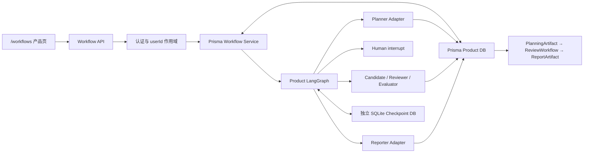

# Phase 6 技术专题：产品工作流、Checkpoint 与故障恢复
<!-- 文件名：phase-6-workflow-checkpoint-completion - 工作流与Checkpoint恢复 -->
<!-- 所属目录：remediation - 工程整改实施 -->

报告日期：2026-07-15  
统计时间：2026-07-15 22:04（Asia/Shanghai）  
报告性质：REPORT-3 完成报告 / Phase 6 技术附卷  
当前状态：已完成并通过自动化验收  
面向读者：项目答辩者、开发人员、测试人员，以及第一次接触工作流系统的普通读者

## 摘要

本阶段把原先分散的 Planner、Review、人工确认和 Reporter 串成一个产品级 LangGraph 工作流。用户现在可以在 `/workflows` 创建一条开发报告任务，查看七个业务节点，遇到信息不足或高影响取舍时暂停，提交补充信息或人工裁决后从同一个 `threadId` 和持久 Checkpoint 继续。工作流既支持确定性 baseline，也支持 Planner、双候选、Reviewer、Evaluator、Reporter 的真实模型适配模式。

系统没有把完整 Checkpoint、模型密钥或原始内部错误发送给浏览器。产品查询使用 Prisma 中的 `DevelopmentWorkflow` 和 `WorkflowNode`，图执行状态存放在独立 SQLite Checkpoint 数据库。每个会产生数据库或模型副作用的节点都有稳定幂等键；网络重试、重复人工提交和进程恢复不会再次生成已经完成的计划、评审或报告。

本阶段还解决了旧版 `dev.db` 没有 Prisma migration history 的 P3005 问题：迁移脚本只自动识别完全匹配初始结构的旧库，先备份，再登记初始迁移并应用后续迁移；无法识别的非空数据库会被拒绝，不会被猜测性修改。

最终证据为：59/59 单元测试、24/24 核心 E2E、1/1 Session 隔离 E2E、8/8 SQLite migration、SQLite/PostgreSQL Schema、全量 Lint 和 Next.js 生产构建全部通过。

## 1. 白话结论

可以把 Checkpoint 理解为“工作流的安全存档点”。

普通表单提交失败时，用户往往只能重新开始。AgentForge 现在会记住：需求分析做到哪里、计划是哪一版、是否已经完成评审、当前在等用户补充什么、报告是否已经生成。用户刷新页面或服务进程发生异常后，不需要从第一步重新付费执行。

这并不等于“把所有模型上下文发给前端”。浏览器只看到适合产品展示的节点状态、Artifact ID、脱敏的暂停原因和一个 Checkpoint 标识；真正的图状态保留在服务端。

## 2. 问题定义与完成标准

REPORT-3 修改前有三个核心缺口：

1. Planner、Review 和 Reporter 是分开的 API，用户需要自己理解调用顺序；
2. 人工确认只能保存业务决定，不能表示“图暂停在这里，稍后从这里继续”；
3. 页面刷新、网络重试或进程异常后，系统缺少统一恢复入口，也无法证明不会重复调用模型。

本阶段采用以下完成标准：

- 一个产品 API 能创建 baseline 或 model 工作流；
- 工作流有稳定 `threadId`，每次暂停都有持久 Checkpoint；
- 缺失信息和人工裁决都使用 `interrupt/resume`；
- 已完成节点恢复时不重复入库、重复收费或重复生成报告；
- UI 能解释当前节点、等待原因、Artifact 链和恢复动作；
- 完整 Checkpoint、凭证和原始 Provider 错误不进入浏览器 DTO；
- 用户 B 不能读取、恢复或裁决用户 A 的工作流；
- 崩溃恢复具有并发认领和租约边界；
- 新旧 SQLite 数据库都有安全、可复现的迁移路径。

## 3. 当前总体架构



这里有两种不同的“保存”：

- Checkpoint 保存图下一步从哪里继续；
- Prisma Artifact 保存用户可以查询、审计和导出的产品事实。

两者不能互相替代。只保存 Checkpoint，产品页面难以稳定查询；只保存 Artifact，图不知道中断后应从哪个节点继续。

## 4. 七个产品节点

| 顺序 | 节点 | 主要职责 | 可能产生的 Artifact | 可暂停 |
|---:|---|---|---|---|
| 1 | `analyze_requirement` | 表示需求已经进入结构化分析 | PlanningArtifact | 否 |
| 2 | `create_plan` | 分析需求、生成计划和动态目录 | PlanningArtifact | 否 |
| 3 | `clarification` | 请求用户补充关键缺失信息 | 新一轮 PlanningArtifact | 是 |
| 4 | `cross_review` | 双候选、Finding、Evaluator | ReviewWorkflow | 否 |
| 5 | `human_approval` | 记录交付/质量/混合/拒绝选择 | ReviewWorkflow 决策 | 是 |
| 6 | `generate_report` | 生成动态开发报告 | ReportArtifact | 否 |
| 7 | `finalize` | 汇总 completed/partial/blocked/inconclusive/failed | 最终状态 | 否 |

页面中的 `analyze_requirement` 是面向用户的业务步骤；当前图把实际分析与计划生成封装在 `create_plan` 节点中。这一选择保持图状态紧凑，也避免把中间自由文本当成未经验证的产品 Artifact。

## 5. 状态模型

### 5.1 DevelopmentWorkflow

该表保存可查询的工作流摘要：

- 所有者 `userId`；
- LangGraph `threadId`；
- 当前状态与节点；
- 原始需求和 baseline/model 模式；
- 只包含 Agent ID 的 `agentConfigJson`；
- Planning、Review、Report Artifact 外键；
- Checkpoint ID和 namespace；
- 脱敏 interrupt、最后一次 resume、稳定错误码；
- 并发 `version`、执行租约 `leaseExpiresAt`；
- 开始、完成、创建和更新时间。

### 5.2 WorkflowNode

每条工作流预先创建七个节点记录。节点保存：状态、顺序、尝试次数、Artifact 类型和 ID、白话摘要、稳定错误码以及开始/结束时间。UI 不需要读取 LangGraph 内部通道就能展示时间线。

### 5.3 图状态最小化

Checkpoint 中只保存图继续执行需要的字段，例如 workflowId、threadId、userId、需求、Artifact ID、轮次、节点结果状态和人工选择。API Key、完整报告正文和 Prisma 实体不会重复塞入图状态。

## 6. baseline 与 model 使用同一工作流

两种模式共享节点、Artifact 契约、预算、状态和恢复语义。

### 6.1 baseline

baseline 使用确定性生成器，适合离线演示、回归测试和理解流程。它不会产生 Provider 费用，但仍创建真实 Run、PlanningArtifact、ReviewWorkflow 和 ReportArtifact。

### 6.2 model

model 模式要求配置：

- 1个 Planner；
- 2个候选角色；
- 1个 Reviewer；
- 1个 Evaluator；
- 1个 Reporter。

同一个 Agent 配置可以承担多个角色，但候选仍是两次彼此输入隔离的调用。所有 Agent ID 必须属于当前用户；缺少凭证、超预算或结构化输出连续失败时，工作流安全停止并记录稳定错误码。

模型适配继续使用原有 Planner、Review 和 Report 服务，因此不会出现“独立 API 有预算，统一工作流绕过预算”的第二套实现。TokenUsage 和费用仍关联各节点自己的 Run。

## 7. 暂停与恢复

### 7.1 补充信息

Planner 判断关键资料不足时保存 `needs_clarification` PlanningArtifact，图在 `clarification` 节点执行 `interrupt`。用户回答后，`Command({ resume })` 把答案合并到需求，轮次加一，并使用新的节点幂等键生成下一版计划。最多两轮，不会无限追问。

### 7.2 人工裁决

Evaluator 发现有证据支持的高影响交付/质量冲突时，图在 `human_approval` 暂停。用户可以选择 delivery、quality、hybrid 或 reject，并附说明。裁决通过 ReviewWorkflow 的原子更新保存；相同请求可安全重试，不同决定不能覆盖第一次决定。

### 7.3 为什么节点会重新进入

LangGraph 的 interrupt 恢复语义会从包含 interrupt 的节点重新执行。因此，interrupt 之前不能放不可重复的无保护副作用。本项目把人工决定写入放在 resume 返回之后，并让裁决本身具备业务幂等性。

## 8. 幂等设计

| 副作用节点 | 幂等键 | 重放行为 |
|---|---|---|
| 计划第 N 轮 | `workflowId:plan:N` | 返回已有 PlanningArtifact |
| 交叉评审 | `workflowId:review` | 返回已有 ReviewWorkflow |
| 人工裁决 | ReviewWorkflow pending 状态 + 同值比较 | 相同裁决返回原记录，不同裁决409 |
| 报告生成 | `workflow:workflowId:report:1` | 返回已有 ReportArtifact v1 |
| Checkpoint resume | `lastResumeJson` + 乐观版本 | 相同输入回放当前结果，不同输入冲突 |

这意味着“HTTP 响应丢失后客户端重试”和“Artifact已经持久化、但Checkpoint输出同步前进程崩溃”不会重复生成或重新收费。

## 9. 故障恢复与租约

工作流进入执行状态时会写入30分钟租约。正常暂停、完成或失败后租约清除。

`POST /api/workflows/:id/recover` 只允许两种情况：

1. 工作流因异常失败并保留 `lastErrorCode`；
2. 工作流仍显示 running，但执行租约已经过期。

恢复请求首先用 `status + version` 原子认领，避免两个请求同时恢复。随后读取相同 thread 的最新 Checkpoint：

- 如果 Checkpoint 已经处于 interrupt，只把 Prisma 状态对账为等待输入；
- 如果还有未完成节点，使用 `graph.invoke(null, sameThreadConfig)` 继续；
- 如果副作用已经完成，节点适配器通过幂等键读取原 Artifact；
- 如果再次失败，保留新的稳定错误码和 Checkpoint。

30分钟租约是当前单实例 Web MVP 的保守边界，不是分布式心跳。多实例生产部署仍应增加周期心跳、队列可见性超时或数据库租约续期。

## 10. Checkpoint 与安全边界

完整 Checkpoint 位于 `WORKFLOW_CHECKPOINT_DB_PATH` 指定的独立 SQLite 文件，默认是 `prisma/workflow-checkpoints.db`。顶层图使用空 `checkpoint_ns`，`thread_id` 是稳定恢复游标。

API 只返回：

```json
{
  "checkpoint": {
    "id": "opaque-checkpoint-id",
    "namespace": ""
  }
}
```

不会返回 `channel_values`、`versions_seen`、模型消息、API Key或原始 Provider 错误。E2E 对这些内部字段做了反向断言。

用户作用域在 Prisma 查询、Artifact 外键、Agent选择、恢复、详情和列表 API 中重复验证。Session E2E 已证明用户 B 对用户 A 的 detail、resume 和 recover 都得到404。

## 11. API 契约

### 11.1 创建

`POST /api/workflows`

baseline：

```json
{
  "requirement": "至少20个字符的项目需求",
  "mode": "baseline",
  "agents": {}
}
```

model：

```json
{
  "requirement": "至少20个字符的项目需求",
  "mode": "model",
  "agents": {
    "plannerAgentId": "agent-id",
    "candidateAgentIds": ["agent-a", "agent-b"],
    "reviewerAgentId": "agent-id",
    "evaluatorAgentId": "agent-id",
    "reporterAgentId": "agent-id"
  }
}
```

工作流暂停时返回202，直接完成时返回201。

### 11.2 查询

- `GET /api/workflows`：当前用户最近30条；
- `GET /api/workflows/:id`：当前用户拥有的单条详情；
- 两个接口都返回安全业务 DTO，不返回完整 Checkpoint。

### 11.3 恢复人工输入

- `POST /api/workflows/:id/resume`；
- clarification 提交 `answer`；
- approval 提交 `decision` 和可选 `note`。

### 11.4 故障恢复

- `POST /api/workflows/:id/recover`；
- 不接受用户构造图状态；
- 只从服务端已有 Checkpoint 继续。

## 12. 产品页面

`/workflows` 使用三栏布局：

1. 左侧创建工作流、选择 baseline/model 和六个模型角色，并浏览历史；
2. 中间展示七节点时间线、状态、摘要、Artifact 和安全 Checkpoint 标识；
3. 右侧展示 clarification/approval 表单、Artifact 链和恢复语义说明。

失败且可恢复时显示“从持久化状态恢复”。终态失败已经完成对账后不会继续显示恢复按钮，避免无限点击。

报告中心增加“开发工作流”入口；主工作台也保留工作流和报告导航。对话、工作流和报告已经形成三个不同产品职责，而不是把所有信息堆在聊天气泡中。

## 13. 数据库迁移与旧库保护

第8个迁移 `20260715220000_add_development_workflow_checkpoints` 新增：

- PlanningArtifact/ReviewWorkflow 节点幂等键；
- DevelopmentWorkflow；
- WorkflowNode；
- 关系、唯一约束和查询索引。

旧开发库最初由非 migration 方式创建，因此直接 `prisma migrate deploy` 会产生 P3005。新的 `scripts/run-prisma-migrate.mjs` 执行以下流程：

```text
读取 SQLite 表和列
  → 已有 _prisma_migrations：正常 deploy
  → 空库：正常 deploy
  → 精确匹配初始版结构：先备份 → resolve 初始迁移 → deploy其余迁移
  → 其他非空结构：拒绝操作并要求人工比对
```

当前 `prisma/dev.db` 已通过该路径完成迁移，并保留带时间戳备份。脚本再次运行不会重复迁移。

## 14. 实验与验证

### 14.1 单元测试

新增三项图行为测试：

- 审批暂停后恢复，不重复 plan/review；
- 补充信息进入新的有限计划轮次；
- Review 节点模拟瞬时崩溃后，从最新 Checkpoint 继续，已完成 plan 只执行一次。

单元测试总结果：59/59。

### 14.2 核心 E2E

新增四类产品工作流证据：

1. baseline 工作流页、审批暂停、恢复、报告生成和重复 resume；
2. clarification 新计划轮次和继续生成报告；
3. model 完整角色校验、非法结构化输出两次失败、恢复时不再次调用模型；
4. model 成功贯通 Planner、两个独立候选、Reviewer、Evaluator、人工裁决和 Reporter。

成功模型 E2E 使用本地受控 Ollama 协议桩验证集成语义，共发生7次角色调用；相同审批重试后仍是7次且 ReportArtifact 仍为 v1。该实验不冒充外部真实模型质量盲评。

非法Planner输出测试还比较调用前后的Dashboard Token统计，证明两次被拒绝的模型响应仍写入TokenUsage；恢复失败Checkpoint时调用次数和Token不会再次增加。

核心 E2E 总结果：24/24。

### 14.3 Session 隔离

Session A→B→A 测试增加 Workflow 列表、详情、resume、recover 和 Checkpoint DTO隔离。结果：1/1。

### 14.4 工程门

| 检查 | 结果 |
|---|---|
| SQLite migration | 8/8，空库可部署；旧初始库可备份后升级 |
| SQLite Prisma Schema | 通过 |
| PostgreSQL Prisma Schema | 通过（仍无独立 migration history） |
| TypeScript / Next.js build | 通过，生成 `/workflows` 与三类 Workflow API 路由 |
| 全量 ESLint | 通过 |
| 单元测试 | 59/59 |
| 核心 E2E | 24/24 |
| Session E2E | 1/1 |

## 15. 失败实验与修正

### 15.1 namespace 读取不到状态

最初产品同步使用了非空 namespace，但顶层图实际把 Checkpoint 写入空 namespace，导致 `getState` 返回空状态。通过独立 SQLite 图实验确认后，顶层配置统一为 `checkpoint_ns: ""`。非空 namespace 保留给未来子图。

### 15.2 旧数据库 P3005

第一次在已有 `dev.db` 上运行 migration 时出现 P3005，因为数据库非空且没有 migration history。没有强制重置或删除数据，而是加入精确结构识别、自动备份和最小 baseline。先在副本验证8个迁移，再迁移当前开发库。

### 15.3 模型成功 E2E 计数预期错误

第一次测试把 Planner 2次、候选2次、Reviewer 1次、Evaluator 1次错误合计成5次，实际应为6次；Reporter后总计7次。修正断言后再次通过。该失败被保留，因为它说明“角色数”和“调用次数”不能混为一谈。

## 16. 当前限制

- 真实外部模型质量盲评仍未完成；本阶段证明的是工作流、契约、预算、用量和幂等集成；
- Provider 原生 function/tool calling 尚未接入，当前知识 Tool 仍由受控 API适配器执行；
- Checkpoint 当前使用 SQLite，适合单机 Web MVP；多实例部署应选用共享持久化 checkpointer；
- 当前能够保证已持久化节点的幂等回放；如果Provider已经计费并返回、但进程恰好在原始响应或Artifact落库前崩溃，系统无法从本地证明调用结果，仍存在极小的“结果未知”窗口。要实现更强的费用去重，需要Provider幂等键或持久ModelCall账本与人工处理策略；
- 租约没有周期心跳，30分钟内的真实进程悬挂需要等待租约到期或运维介入；
- PostgreSQL 只有 Schema，没有独立 migration history；
- PDF/DOCX不在当前正式导出范围，当前可审计导出为 Markdown；
- 完整 WCAG人工审计和真实多尺寸设备验收仍待单独执行。

## 17. 验收结论

- [x] 产品级工作流统一 Planner、Review、人工确认和 Reporter；
- [x] baseline/model 共用同一状态图和 Artifact 契约；
- [x] clarification和approval可暂停与恢复；
- [x] Checkpoint持久化并按相同 thread继续；
- [x] 完整 Checkpoint不暴露给浏览器；
- [x] 重复 resume不重复生成Artifact或模型费用；
- [x] 崩溃恢复不重复已完成副作用；
- [x] 故障恢复具有租约、乐观版本和并发冲突；
- [x] Workflow列表、详情、resume和recover按用户隔离；
- [x] 工作流页面能解释节点、暂停、Artifact链和恢复；
- [x] 旧初始数据库可备份后安全迁移，未知结构会拒绝；
- [x] 全量工程验证通过。

REPORT-3 标记为已完成，Phase 6 总状态改为已完成（3/3）。

## 18. 主要实现文件

- `src/lib/workflow/contracts.ts`：工作流、节点、模式、角色和 resume契约；
- `src/lib/workflow/product-graph.ts`：产品图、interrupt、resume和continue；
- `src/lib/workflow/checkpointer.ts`：独立 SQLite Checkpoint saver；
- `src/lib/workflow/prisma-dependencies.ts`：baseline/model节点适配与幂等；
- `src/lib/workflow/prisma-workflow.ts`：产品记录同步、认领、恢复和安全 DTO；
- `src/app/api/workflows/`：列表、创建、详情、resume和recover；
- `src/components/workflows/workflow-center.tsx`：产品工作流页面；
- `prisma/migrations/20260715220000_add_development_workflow_checkpoints/`：第8个迁移；
- `scripts/run-prisma-migrate.mjs`：旧库识别、备份、baseline和deploy；
- `e2e/core.spec.ts`、`e2e/session-isolation.spec.ts`：完整链路与隔离证据。

## 19. 后续顺序

1. 项目所有者完成历史密钥和 Secrets 外部轮换；
2. 执行单 Agent、双 Agent、RAG、交叉评审和人工裁决的真实模型盲评，关闭 P2-4；
3. 扩大 RAG固定语料和查询集；
4. 根据部署目标决定共享 Checkpointer、PostgreSQL migration history和租约心跳；
5. 决定PDF/DOCX是否进入正式交付范围；
6. 执行完整WCAG人工审计和多尺寸体验验收。

## 20. 技术依据

实现遵循 LangGraph 官方持久化与 interrupt 语义：每个 thread 使用稳定 `thread_id`，Checkpointer 保存图状态；恢复 interrupt 时节点会重新进入，因此副作用必须放在 interrupt 之后或具备幂等保护。

- [LangGraph Persistence](https://docs.langchain.com/oss/javascript/langgraph/persistence)
- [LangGraph Interrupts](https://docs.langchain.com/oss/javascript/langgraph/interrupts)
- [SQLite Checkpoint package](https://reference.langchain.com/javascript/modules/_langchain_langgraph-checkpoint-sqlite.html)

这些资料解释框架语义；本项目的产品状态表、Artifact幂等键、用户隔离、租约和安全 DTO仍由 AgentForge 自己实现和测试。
