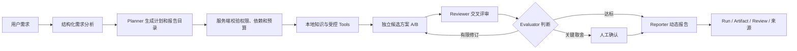
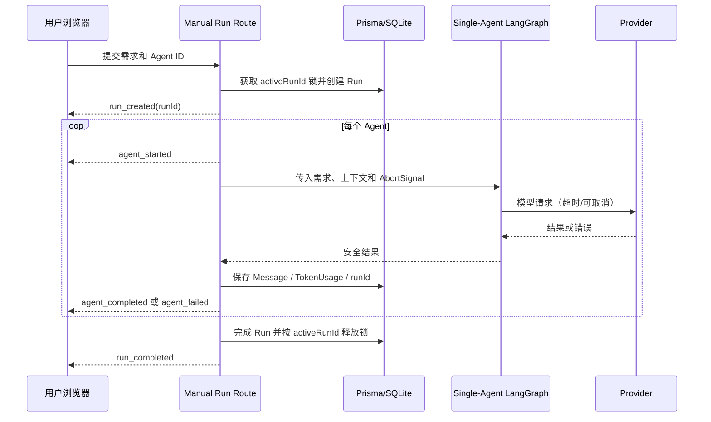

# AgentForge 工程整改与开发总报告
<!-- 文件名：final-report - 工程整改与开发总报告 -->
<!-- 所属目录：remediation - 工程整改实施 -->

报告性质：阶段性完整版，可用于当前项目答辩、开发交接与后续持续更新  
报告版本：2026-07-19.1
统计时间：2026-07-19（Asia/Shanghai）
项目目录：`Multi-Agent-Workspace`
<<<<<<< HEAD:docs/remediation - 工程整改实施/2026-07-19 - final-report - 工程整改与开发总报告.md
写作标准：[答辩级工程报告写作规范](./2026-07-15 - reporting-standard - 答辩级报告写作规范.md)
事实来源：[当前开发状态](../2026-08-01 - current-development-status - 当前开发状态.md)、[整改总览](./2026-07-20 - remediation-index - 整改执行总览.md)、[正式设计](../design - 产品设计方案/旧 - design-index - 设计文档总入口.md)及自动化验证结果
=======
写作标准：[答辩级工程报告写作规范](reporting-standard - 答辩级报告写作规范.md)
事实来源：[当前开发状态](../current-status - 当前开发状态.md)、[整改总览](README - 整改执行总览.md)、[正式设计](../design - 产品设计方案/README - 设计文档总入口.md)及自动化验证结果
>>>>>>> origin/agent/agentforge-publish-2026-07-20:docs/remediation - 工程整改实施/final-report - 工程整改与开发总报告.md

> 本报告已经完整描述“当前做到哪里、如何证明、还缺什么以及下一步怎么做”。后续阶段尚未实现的能力不会伪装成完成，而是以目标、依赖和验收条件的形式保留。

---

## 摘要

AgentForge 是一个面向 Web 项目的多智能体需求规划与开发方案生成平台。用户提供项目需求后，目标系统将通过结构化需求分析、执行计划、本地专业知识、候选方案、交叉评审、质量评价和人工确认，生成带来源、风险、取舍依据和实施步骤的动态开发方案报告。

当前代码处于“从需求到可恢复、可审计动态报告”的 Web MVP阶段。用户需求会先经过结构化分析、关键缺失信息判断、动态计划和报告目录选择；随后生成彼此输入隔离的 delivery/quality 候选，经结构化 Reviewer Finding、动态 Rubric Evaluator 和人工确认得到可追踪决策；Reporter最终创建带状态、来源、版本和幂等键的ReportArtifact。`/workflows`已经用产品级LangGraph统一这些步骤，缺失信息和高影响取舍可通过持久Checkpoint暂停、恢复，异常失败可在幂等键、租约和乐观锁保护下继续。真实模型盲评的匿名发卷、私有解盲与汇总工具已具备，但尚待收集真实模型和独立人工评分。

截至统计时间，仓库侧已经停止跟踪 `.env`，建立九次可复现SQLite migration；手动、持久和Demo三入口统一到RunService和v1事件。认证Planner能够生成并保存分析、补充问题、计划和动态目录；计划授权的 `knowledge-search` 返回章节、行号、版本、许可和SHA-256引用；ReviewWorkflow保存候选、Finding、Evaluator、失败终态、预算、修订轮次和人工裁决；ReportArtifact保存动态章节、Claim、来源清单、版本链和生成幂等键；DevelopmentWorkflow和WorkflowNode保存产品状态，完整图状态由独立SQLite Checkpointer管理。Workspace创建会原子绑定当前用户Agent，前端已按页面职责拆分。2026-07-19文档收口后最终统一质量门禁退出码为0，证据包括72项单元测试、24项隔离数据库核心E2E、1项Session账号切换E2E、31个仓库文档Chunk的6/6检索命中、TypeScript、生产构建和全量Lint通过。仓库新增无回显的密钥轮换验收脚本，但历史主加密密钥仍需项目所有者在外部完成轮换，60次真实模型运行和至少2名独立评分者结果仍未完成。

本报告的结论是：AgentForge已经形成能够从结构化需求生成有版本、有来源、可暂停恢复、可人工裁决、可导出Markdown的开发方案报告Web MVP；真实模型质量收益、生产级多实例恢复和桌面正式交付仍没有完成。

关键词：多智能体、需求规划、开发方案、LangGraph、SSE、Run、RAG、工程整改、可追溯报告

---

## 三分钟答辩摘要

### 项目要解决什么问题

普通大模型可以一次生成一份开发建议，但经常存在需求遗漏、方案不可验证、来源不清楚、多个角色结论互相矛盾等问题。AgentForge 的目标是把需求分析、方案提出、专业知识、交叉评审和最终报告组织成一个受控流程。

### 当前已经能做什么

- 创建和配置不同职责的 Agent；
- 按顺序运行多个 Agent，并把前序结果交给后续 Agent；
- 通过 SSE 实时展示开始、完成、失败和结束；
- 加密保存 Provider API Key，浏览器只看到掩码；
- 保存消息、失败结果、Token 用量和每次运行记录；
- 同一用户的并发运行不会交错；
- 模型超时或用户取消后停止当前请求和后续 Agent；
- 使用隔离数据库完成自动化 E2E，不污染开发数据库。
- 把自然语言需求转换为结构化分析、受校验计划和动态报告目录；
- 关键资料不足时给出有原因的补充问题；
- 保存规划成功、待补充或失败结果，并关联用户和 runId。

### 本轮最重要的变化

```text
修改前：一次请求只是若干消息，失败、并发和费用难以追踪
修改后：一次请求对应一个 Run，拥有 runId、状态、时间、消息、费用和错误码
```

### 当前还不能做什么

- 尚未实现面向任意专业任务的自动调度；
- Planner、Review和Reporter已合并为带Checkpoint的单一可恢复工作流，但尚未完成任意专业任务的自动调度；
- 受控Tool执行已闭环，Provider原生 Tool Calling仍未接入；
- 当前RAG仍为TF-IDF；12类固定夹具和基于两份项目文档的31个Chunk/6意图冒烟门禁不能代表通用检索或真实模型质量；
- 还没有完成生产部署、多实例并发和 Electron 安装包验收；0.1正式交付范围已经明确为Web MVP。

### 如何证明不是只改了文档

当前验证结果为：文档收口后的最终 `npm run quality:all` 退出码0；单元测试72/72、核心E2E 24/24、Session账号切换E2E 1/1；仓库文档检索31个Chunk、6/6命中；九次migration从空库成功应用；TypeScript、生产构建和全量Lint通过。本报告同时保留失败实验和未解决问题，不用“构建成功”代替业务正确性证明。

---

## 目录

1. [项目背景与问题定义](#1-项目背景与问题定义)
2. [产品定位与目标工作流](#2-产品定位与目标工作流)
3. [研究问题、约束与完成标准](#3-研究问题约束与完成标准)
4. [整改前系统基线](#4-整改前系统基线)
5. [当前技术架构](#5-当前技术架构)
6. [当前数据模型与运行状态](#6-当前数据模型与运行状态)
7. [Phase 0 安全与数据库](#7-phase-0-安全与数据库)
8. [Phase 1 运行正确性](#8-已完成整改phase-1-运行正确性)
9. [Phase 2～3完成情况与后续目标阶段](#9-phase-23完成情况与后续目标阶段)
10. [实验设计与验证结果](#10-实验设计与验证结果)
11. [失败实验与修正记录](#11-失败实验与修正记录)
12. [方案比较与关键决策](#12-方案比较与关键决策)
13. [安全、隐私与成本分析](#13-安全隐私与成本分析)
14. [整改前后对比](#14-整改前后对比)
15. [当前风险与优先级](#15-当前风险与优先级)
16. [开发路线与依赖关系](#16-开发路线与依赖关系)
17. [项目贡献与工程价值](#17-项目贡献与工程价值)
18. [有效性威胁与局限性](#18-有效性威胁与局限性)
19. [当前结论](#19-当前结论)
20. [参考与证据索引](#20-参考与证据索引)
21. [技术附录](#附录-a核心文件索引)

---

## 1. 项目背景与问题定义

### 1.1 背景

Web 项目开发方案通常需要同时考虑需求、用户流程、界面、技术架构、数据模型、接口、权限、测试、部署和风险。单次模型回答可能覆盖其中一部分，但很难稳定完成以下任务：

1. 识别需求中缺失的信息；
2. 根据项目类型选择不同的报告目录；
3. 使用经过审核的专业知识；
4. 让不同目标导向的方案相互检查；
5. 解释为什么选择某个方案；
6. 在失败、超时或预算耗尽时正确收敛；
7. 保存证据，方便用户复查和继续开发。

AgentForge 因此不把“多个 Agent 聊天”当成最终目标，而是把多个角色组织为可追踪、可限制、可评审的报告生成流程。

### 1.2 核心问题

本项目需要同时解决两类问题：

| 类型 | 白话解释 | 示例 |
|---|---|---|
| 产品问题 | 最终应该生成什么、用户如何参与 | 报告章节是否动态、冲突是否需要人工确认 |
| 工程问题 | 系统如何可靠、安全地运行 | 密钥是否泄漏、请求能否取消、消息是否串行 |

如果只做产品界面而忽略工程问题，系统可能把失败写成成功、在用户离开后继续计费，或者让不同运行的消息混在一起。如果只做底层工程而没有 Planner 和报告流程，系统又会停留在普通聊天工作台。因此整改顺序先建立底座，再实现产品核心。

### 1.3 目标用户

- 需要把想法整理成开发方案的初学者；
- 需要快速形成需求、架构和验收文档的独立开发者；
- 需要比较多个技术方案的项目负责人；
- 需要观察多 Agent 过程、证据和风险的教学或研究场景。

### 1.4 非目标

- 不自动编写整个项目的全部代码；
- 不自动部署到生产环境；
- 不允许无限循环讨论或无限调用模型；
- 不让模型执行未经授权的高风险写操作；
- 不把多个模型的共识当成事实；
- 不在没有真实验证时宣称生产级稳定或完全符合 WCAG。

---

## 2. 产品定位与目标工作流

### 2.1 一句话定位

> AgentForge 是面向 Web 项目的多智能体需求规划与开发方案生成平台，核心产物是动态、可追溯、经过评审的开发方案报告。

### 2.2 目标工作流



这张图表达三个关键原则：

1. Planner 只提出计划，服务端必须校验后才能执行；
2. 评审不是无限聊天，而是有限轮次的质量控制；
3. 最终报告必须能够追溯到需求、知识、候选方案、评审和人工决定。

### 2.3 动态报告

报告目录不固定为同一套模板。例如：

| 项目类型 | 重点章节 |
|---|---|
| 企业官网 | 信息架构、页面、视觉、SEO、性能、部署 |
| 管理后台 | 用户角色、权限、数据模型、接口、审计、测试 |
| 学习计划应用 | 任务流、计时、统计、状态管理、提醒、验收 |

当前产品工作流已经实现上述动态目录和结构化校验；手动双 Agent聊天仍保留为轻量演示入口，不再代表产品能力上限。

---

## 3. 研究问题、约束与完成标准

### 3.1 研究问题

| 编号 | 研究问题 | 当前证据与结论 |
|---|---|---|
| RQ1 | 凭证是否会进入浏览器或 SSE？ | DTO、E2E 与服务端解密边界证明当前核心链路不返回原始 Key |
| RQ2 | 新环境能否从零建库？ | 九次 SQLite migration 在唯一临时数据库成功应用；旧初始库还有备份升级证据 |
| RQ3 | Agent 部分失败会不会被后续成功覆盖？ | 终态聚合单测和 E2E 证明不会 |
| RQ4 | 两个并发运行会不会混在一起？ | Run/activeRunId 和并发 E2E 证明同用户运行被拒绝或串行化 |
| RQ5 | 用户取消后 Provider 是否继续？ | SSE 取消 E2E 观察到 Provider 连接关闭，后续运行可重新取得锁 |
| RQ6 | 当前RAG是否可靠？ | 已修复结构、零召回与词频；12类固定夹具和31个项目文档Chunk的6/6门禁可用于离线回归，但仍不能代表通用检索或真实模型质量 |
| RQ7 | 多 Agent 是否明显优于单 Agent？ | 已冻结12案例和5变体并贯通合成dry-run，但60次真实模型运行和至少2名独立评分者结果尚未完成，不能下结论 |
| RQ8 | 动态报告工作流是否完成？ | 已完成：Planner、Review、人工确认、ReportArtifact、动态报告、版本、导出、报告中心、统一工作流页和Checkpoint恢复均有自动化证据 |

### 3.2 工程约束

- 当前主要数据库是本地 SQLite；
- PostgreSQL 只维护 Schema 静态验证，没有独立 migration history；
- 当前应用是 Next.js Web MVP，Electron 只是未验收的壳；
- 自动测试不得调用真实收费 Provider；
- 测试不得读取或修改开发者的 `prisma/dev.db`；
- API Key、Session Secret 和主加密密钥不得进入报告、日志或截图。

### 3.3 证据等级

本报告采用以下证据等级，避免把局部测试扩大解释：

| 等级 | 证据 | 可以证明什么 |
|---|---|---|
| E1 | 静态代码检查 | 代码结构、字段和明显分支 |
| E2 | 单元测试 | 单个规则或模块行为 |
| E3 | 隔离数据库 E2E | 当前单机 Web 主链路行为 |
| E4 | 生产构建或多环境验证 | 编译、类型和特定环境可交付性 |
| E5 | 长期生产与真实用户数据 | 生产稳定性和真实质量收益 |

当前最高证据主要到 E4，没有 E5，因此不能宣称生产级完成。

---

## 4. 整改前系统基线

2026-07-15 的代码与文档评审得到以下基线：

| 维度 | 整改前事实 | 影响 |
|---|---|---|
| `.env` | 仍在 Git 跟踪范围 | 历史密钥可能继续有效 |
| 数据库 | 旧 `init.sql` 被删除且格式过时 | 新环境初始化不可证明 |
| E2E | 未在隔离数据库完成 | 测试可能污染真实数据 |
| 终态 | 前序失败可能被后续成功覆盖 | 用户看到错误的成功状态 |
| 并发 | 只有前端页面锁 | 多标签页和直接 API 可绕过 |
| 运行身份 | 没有 Run/runId | 消息、用量和错误难以归属 |
| Provider | 无统一超时和取消 | 用户离开后可能继续请求和计费 |
| RAG | 标题结构丢失、通用词零召回 | 知识引用不可靠 |
| Tool | Registry 未初始化，部分工具为占位 | 不能称为完整 Tool Calling |
| 前端 | 主组件约1578行 | 修改风险和 Lint 问题集中 |
| Lint | 6个错误、10个警告 | 工程质量门未关闭 |

整改前已有的正向能力包括：API Key AES-256-GCM 加密、Agent DTO 掩码、顺序 Agent、SSE、消息持久化、TF-IDF 检索原型和6项 LangGraph 单元测试。

---

## 5. 当前技术架构

### 5.1 技术栈

| 层次 | 技术 | 当前作用 |
|---|---|---|
| Web | Next.js 16、React 19、TypeScript | 页面、API Route、服务端运行入口 |
| 状态 | Zustand | 前端工作区和 SSE 事件消费 |
| 数据 | Prisma 7.8、SQLite | 用户、Agent、Workspace、Run、消息和用量 |
| 模型 | OpenAI SDK、Anthropic SDK、Ollama fetch | Provider 适配 |
| 工作流 | LangGraph | 单Agent执行内核和产品级可恢复开发报告状态图 |
| 检索 | 自研TF-IDF | 当前轻量RAG、标题/行号引用与离线回归门禁 |
| 测试 | Node test、Playwright | 单元与隔离数据库 E2E |
| 桌面 | Electron | 未完成交付验收的壳 |

### 5.2 当前手动运行链路



### 5.3 当前与目标架构的差别

```text
手动链：Route → RunService → SingleAgent LangGraph → adapters → persistence/events
产品链：Workflow API → Product LangGraph + Checkpointer → Planner/Review/Approval/Reporter → Artifacts
下一目标：真实模型盲评、共享Checkpointer和部署级多实例恢复
```

三条手动入口已经统一成 RunService和 v1事件契约；Planner、Review、Artifact和Checkpoint已经通过独立产品工作流进入主链路。两条链分别服务“自由协作演示”和“结构化开发报告生成”，共享Provider、持久化和安全边界。

---

## 6. 当前数据模型与运行状态

### 6.1 核心实体

| 实体 | 作用 | 关键关系 |
|---|---|---|
| User | 用户和预算边界 | 拥有 Agent、Workspace、Run、Document |
| Agent | 角色、模型和 Prompt | 可拥有独立加密凭证 |
| Workspace | 工作空间和运行锁 | 保存 status、activeRunId、预算 |
| Run | 一次完整运行 | 关联用户、工作区、消息、用量 |
| Message | 用户或 Agent 消息 | 可关联 runId、agentId、TokenUsage |
| TokenUsage | 模型用量和成本 | 关联 runId、messageId、agentId |
| Document/Chunk | 用户知识库 | 用于当前 TF-IDF 检索 |
| PlanningArtifact | 需求分析、计划和动态目录 | 关联用户、Run和工作流节点幂等键 |
| ReviewWorkflow | 候选、Finding、评价与人工裁决 | 关联PlanningArtifact、Run和DevelopmentWorkflow |
| ReportArtifact | 不可变动态报告版本 | 关联Plan、Review、Run、来源和generationKey |
| DevelopmentWorkflow | 产品工作流摘要与恢复游标 | 关联threadId、Checkpoint标识和三类Artifact |
| WorkflowNode | 七节点产品时间线 | 关联DevelopmentWorkflow和节点Artifact |

### 6.2 为什么需要 Run

没有 Run 时，只能知道“工作区里有这些消息”，无法准确回答：

- 哪些消息属于同一次任务；
- 哪次任务发生了超时；
- 哪次任务消耗了多少 Token；
- 两个标签页是否同时运行；
- 中断后应该从哪里恢复。

因此 P1-2 新增 Run，并让 Message 和 TokenUsage 保存可空 runId，以兼容历史记录。

### 6.3 终态优先级

```text
exhausted（预算耗尽） > warning（失败/超时/取消） > idle（正常完成）
```

`running` 只能是过程状态，不能作为 `run_completed` 的最终状态。

---

## 7. Phase 0 安全与数据库

### 7.1 `.env` 与历史密钥

仓库侧已经执行：

- `.gitignore` 忽略 `.env` 和 `.env.*`，保留 `.env.example`；
- `.env` 已从 Git 索引移除，本地文件仍保留；
- 当前文本和5个 Git commit 执行了不回显值的特征扫描；
- `security:verify-secrets` 检查 Git 跟踪、常见凭证特征和 session/production 运行时 Secret 是否缺失、占位或过短，不打印实际值；
- 没有发现常见 Provider Key 格式；
- Git 历史确认曾存在非占位的 `ENCRYPTION_MASTER_KEY`。

仍需项目所有者执行：轮换历史主密钥和其他真实 Secrets。主密钥轮换后，旧密钥加密的 Provider 凭证无法直接解密，需要重新保存 API Key 或进行受控重加密。

因此 P0-1 状态是“部分完成”，不能写成安全风险已经完全关闭。

### 7.2 数据库初始化

旧 `init.sql` 格式异常并落后于当前 Schema，没有直接恢复。当前建立了：

1. `20260715000000_init`：SQLite 初始结构；
2. `20260715043000_add_runs`：Run、activeRunId 和 runId 关联；
3. `20260715181000_add_planning_artifacts`：PlanningArtifact；
4. `20260715190000_add_knowledge_sources_and_tool_audit`：知识来源和ToolInvocation；
5. `20260715203000_add_review_workflows`：ReviewWorkflow；
6. `20260715213000_add_report_artifacts`：ReportArtifact版本链；
7. `20260715214500_add_report_generation_idempotency`：报告生成幂等键；
8. `20260715220000_add_development_workflow_checkpoints`：DevelopmentWorkflow、WorkflowNode和节点幂等键；
9. `20260716000000_add_api_key_length`：凭证长度元数据。

迁移配套设施：

- `migration_lock.toml`：明确migration provider为SQLite；
- `run-prisma-migrate.mjs`：阻止PostgreSQL误用SQLite history，并对旧初始库执行精确识别、备份、baseline和升级；
- `run-isolated-e2e.mjs`：创建唯一临时产品数据库与Checkpoint数据库，应用迁移、运行测试并清理临时文件。

P0-2 已完成。PostgreSQL 仍只有 Schema 静态校验，不属于已验证部署目标。

---

## 8. 已完成整改：Phase 1 运行正确性

### 8.1 P1-1：失败终态不再被覆盖

修改前的典型场景是：第一个 Agent 失败，状态变成 warning；第二个 Agent 成功，又把状态改回 idle。用户最终看见正常完成，无法发现报告不完整。

当前新增纯函数 `resolveRunCompletionStatus`，整轮独立记录 `hadAgentFailure`，最终统一聚合。五种单元场景覆盖全部成功、前失败后成功、前成功后失败、全部失败和预算耗尽优先。

结论：P1-1 已完成，证据等级 E3。

### 8.2 P1-2：服务端锁和 runId

采用 `Run + Workspace.activeRunId`，原因是只使用 `status=running` 无法证明谁拥有锁。锁释放使用条件更新，旧请求只有在 activeRunId 仍等于自己的 runId 时才能释放。

SQLite 并发实验第一次预期第二个请求立即拒绝，实际观察到数据库将第二次写操作排队。第二版测试记录 startedAt/finishedAt，接受“明确拒绝”或“两个运行区间不重叠”。复测证明同一用户运行不会交错。

结论：P1-2 已完成，证据等级 E3。多实例数据库锁仍需未来验证。

### 8.3 P1-3：Provider 超时和 SSE 取消

当前实现：

- 默认 Provider 超时120秒；
- 非法配置回退默认值，最大限制10分钟；
- Ollama fetch、OpenAI SDK、Anthropic SDK 均接收 AbortSignal；
- 父级取消转为 `RUN_CANCELLED`；
- 调用超时转为 `PROVIDER_TIMEOUT`；
- 超时或取消停止后续 Agent；
- Run 保存稳定错误码；
- Provider Router 不再承担凭证解密，安全职责移动到独立模块。

E2E 证明：第一个 Agent 超时后第二个 Agent没有启动；客户端取消 SSE 后，延迟 Provider 观察到连接关闭，随后新运行能再次取得锁。

结论：P1-3 已完成，证据等级 E3。反向代理、Serverless 和多实例环境仍待验证。

### 8.4 P1-4：浏览器知识用户隔离

当前状态：已完成（浏览器过渡知识范围），证据等级 E3。

修改前，数据库 Document/Chunk 虽按 userId 限定，但浏览器知识和旧消息降级使用固定 Key；Zustand 又是模块级单例。A 退出、B 登录时，B 可能读取 A 的浏览器知识，或被 A 的迟到异步响应重新写入旧 Agent/消息。

修改后，本地知识键包含 userId；消息历史只信任服务端数据库；登出和组件卸载会清空 Workspace/Agent Store，并取消历史请求和当前运行请求；Agent 加载增加代次校验，过期结果不能覆盖新会话。旧 v1 键没有可证明的所有者，因此采取“删除、不自动迁移”策略，避免把 A 的数据错误交给 B。

验证采用两层证据：4个单元测试验证键隔离、异常记录过滤和旧键清理；Session Playwright 在独立数据库中完成 A→B→A 切换，证明 A/B 知识互不可见且返回 A 后仍能恢复 A 自己的数据，结果1/1通过。local 模式核心 E2E 7/7继续通过。

边界说明：服务端Document/Chunk已经成为唯一产品运行时知识入口，并已具备来源、版本、权限和容量治理；浏览器旧知识键只清理，不再进入运行时。

### 8.5 P1-5：上传边界

当前状态：已完成（当前 Node.js Web 上传入口范围），证据等级 E3。

修改前，上传路径先调用 `file.text()`，再用字符数判断5MB，既拦截过晚，也会低估中文等多字节文本。修改后，系统在 multipart解析前检查6 MiB请求头上限，在读取文件内容前检查5 MiB `file.size`，并用严格 UTF-8解码。数据库 `size` 保存真实字节数。

配额包括：单用户100份文档、50 MiB总容量、20,000个总 Chunk，单文档最多2,000个 Chunk。配额读取与 Document/Chunk嵌套创建位于同一事务；无效 UTF-8、超限或数据库失败都不会留下半写入文档。稳定错误码覆盖 `REQUEST_TOO_LARGE`、`FILE_TOO_LARGE`、`INVALID_UTF8`、`DOCUMENT_LIMIT_REACHED`、`STORAGE_QUOTA_EXCEEDED`、`TOO_MANY_CHUNKS` 和 `CHUNK_QUOTA_EXCEEDED`。

验证结果：4项策略单测验证读取顺序、字节语义和配额；3项新增 E2E 验证中文字节数、5 MiB+1拒绝、无效 UTF-8与2001个 Chunk失败回滚。诚实边界是：缺失 Content-Length时，应用只能在 multipart解析后通过 file.size拒绝；生产环境仍需网关请求体上限。

---

## 9. Phase 2～3完成情况与后续目标阶段

### 9.1 Phase 2：统一 RunService

当前状态：已完成，证据等级 E3。

`runService`成为唯一顺序业务状态机；`RunServiceEventSchema`在发出前校验 version=1和 runId；`createPrismaRunHandle`统一 Run、activeRunId、消息、用量、进度与完成事务；Demo使用内存适配器。新增4项单测和2项入口 E2E，手动原有契约回归继续通过。公共入口不允许客户端指定 runId，单次服务调用只完成一次；消息/用量唯一约束防止同一结果重复写入。显式 idempotency key留给未来队列重试。

### 9.2 Phase 3：Planner 与结构化输出

当前状态：已完成，证据等级 E3。

系统新增 RequirementAnalysis、ExecutionPlan、ReportSection、BudgetState和 ClarificationRequest契约。Planner先分析项目类型、用户、范围、约束和风险；关键资料不足时返回补充问题；否则生成任务、依赖、角色、工具、评价维度和动态报告目录。

模型 Prompt直接包含机器可读 JSON Schema。结构化输出默认最多重试两次；每次同时经过 Zod和服务端语义校验。Agent/Tool白名单、DAG无环、依赖存在性、任务数、轮次、Token、预计费用及任务/章节双向引用任一失败，均不能标记完成。

<<<<<<< HEAD:docs/remediation - 工程整改实施/2026-07-19 - final-report - 工程整改与开发总报告.md
新增PlanningArtifact，以唯一runId关联需求分析、计划、目录、补充请求或失败码，并按userId隔离。官网、后台和学习工具三类fixture生成不同目录；核心E2E验证成功持久化、补充终态和非法模型两次失败；Session E2E验证A的规划记录对B不可见。完整证据见[Phase 3报告](./2026-07-15 - phase-3-planner-and-structured-output - Planner与结构化输出.md)。
=======
新增PlanningArtifact，以唯一runId关联需求分析、计划、目录、补充请求或失败码，并按userId隔离。官网、后台和学习工具三类fixture生成不同目录；核心E2E验证成功持久化、补充终态和非法模型两次失败；Session E2E验证A的规划记录对B不可见。完整证据见[Phase 3报告](phase-3-planner-and-structured-output - Planner与结构化输出.md)。
>>>>>>> origin/agent/agentforge-publish-2026-07-20:docs/remediation - 工程整改实施/final-report - 工程整改与开发总报告.md

### 9.3 Phase 4：知识、RAG 与 Tools

当前状态：已完成，证据等级 E3。

Markdown标题在解析和切块中保留，Chunk记录 headingPath与真实行号；TF-IDF保留词频、使用正值平滑 IDF和稳定排序。Document新增内容校验和、来源、版本、许可和审查时间，前端、Agent和 Tool统一使用服务端 Document/Chunk。

Registry只注册两个真实只读 Tool：`knowledge-search`和 `ui-acceptance-check`。调用必须经过 Zod、Run用户归属、ExecutionPlan授权、次数、大小、AbortSignal和超时校验；ToolInvocation记录 toolCallId、状态、错误码和耗时，并支持完成结果幂等回放。旧占位 Web Search和 `USE_TOOL:`自由文本协议已删除。

<<<<<<< HEAD:docs/remediation - 工程整改实施/2026-07-19 - final-report - 工程整改与开发总报告.md
固定夹具和仓库文档评测只作为离线回归：12类固定意图在无噪声k=1与共享噪声k=5下的Recall、MRR和引用完整率均为1；README与当前状态文档生成31个Chunk，6个检索意图6/6命中目标章节。它们不代表通用检索或模型语义质量。核心E2E证明“来源文档上传 → Planner授权 → Tool返回引用 → 幂等回放 → 未授权失败审计”，Session E2E证明不同账号不能读取对方文档、Run或Tool结果。完整证据见[Phase 4报告](./2026-07-15 - phase-4-knowledge-and-tools - 知识库与受控工具.md)。
=======
固定夹具和仓库文档评测只作为离线回归：12类固定意图在无噪声k=1与共享噪声k=5下的Recall、MRR和引用完整率均为1；README与当前状态文档生成31个Chunk，6个检索意图6/6命中目标章节。它们不代表通用检索或模型语义质量。核心E2E证明“来源文档上传 → Planner授权 → Tool返回引用 → 幂等回放 → 未授权失败审计”，Session E2E证明不同账号不能读取对方文档、Run或Tool结果。完整证据见[Phase 4报告](phase-4-knowledge-and-tools - 知识库与受控工具.md)。
>>>>>>> origin/agent/agentforge-publish-2026-07-20:docs/remediation - 工程整改实施/final-report - 工程整改与开发总报告.md

### 9.4 Phase 5：候选方案和交叉评审

工程闭环已完成：delivery/quality 候选独立生成；Reviewer 提交带失败场景、严重度、证据和建议的 Finding；Evaluator 按动态 rubric 决策；服务端会重算证据支持集合，并强制把有依据的高影响跨候选冲突升级为 `needs_human`。修订0～2轮，模型每角色最多两次结构化尝试，总 Token/费用、Provider超时和请求取消均有边界。

ReviewWorkflow已关联当前用户、PlanningArtifact和独立 Run，并保存候选、Review、Evaluation、失败、预算、轮次和人工裁决。相同裁决重试幂等，不同裁决不能覆盖第一次决定；跨用户审批返回404。

<<<<<<< HEAD:docs/remediation - 工程整改实施/2026-07-19 - final-report - 工程整改与开发总报告.md
当前有3类固定需求的流程契约评估，7项聚合指标均为1；这只证明契约和安全状态机，不代表真实模型语义质量。P2-4已新增[匿名盲评协议](../quality - 质量评测/2026-07-19 - blind-evaluation-protocol - 真实模型盲评协议.md)，冻结12案例并生成5变体共60项计划，具备预检、匿名发卷、评分模板、私有解盲和汇总工具；仍需完成60次真实模型运行和至少2名独立评分者结果。因此Phase 5状态为“工程完成、真实实验未完成”。
=======
当前有3类固定需求的流程契约评估，7项聚合指标均为1；这只证明契约和安全状态机，不代表真实模型语义质量。P2-4已新增[匿名盲评协议](../quality - 质量评测/blind-evaluation-protocol - 真实模型盲评协议.md)，冻结12案例并生成5变体共60项计划，具备预检、匿名发卷、评分模板、私有解盲和汇总工具；仍需完成60次真实模型运行和至少2名独立评分者结果。因此Phase 5状态为“工程完成、真实实验未完成”。
>>>>>>> origin/agent/agentforge-publish-2026-07-20:docs/remediation - 工程整改实施/final-report - 工程整改与开发总报告.md

### 9.5 Phase 6：Artifact 与动态报告

ReportArtifact工程闭环已完成：Reporter读取需求、计划、已审计知识、候选、Review和人工决定，严格按Planner动态目录生成带Claim来源的报告，并区分completed、partial、blocked和inconclusive。报告按版本不可变保存，parentReportId形成链；相同generationKey重试只回放原版本。真实Reporter受两次结构化尝试、Token/费用、超时、取消、敏感输入预拦截和来源二次校验约束。

<<<<<<< HEAD:docs/remediation - 工程整改实施/2026-07-19 - final-report - 工程整改与开发总报告.md
`/reports`独立报告中心展示版本、状态、动态目录、决策、风险、未决项和来源；Markdown导出前重新加载来源链并验证。`/workflows`把Planner、双候选、Reviewer、Evaluator、人工确认和Reporter统一为baseline/model产品图，支持clarification/approval暂停、持久Checkpoint、相同thread恢复、节点幂等和租约故障恢复。Phase 6状态为已完成（3/3）。详细证据见[Phase 6报告](./2026-07-15 - phase-6-dynamic-report-and-ui - 动态报告与产品界面.md)与[Checkpoint技术专题](./2026-07-15 - phase-6-workflow-checkpoint-completion - 工作流与Checkpoint恢复.md)。
=======
`/reports`独立报告中心展示版本、状态、动态目录、决策、风险、未决项和来源；Markdown导出前重新加载来源链并验证。`/workflows`把Planner、双候选、Reviewer、Evaluator、人工确认和Reporter统一为baseline/model产品图，支持clarification/approval暂停、持久Checkpoint、相同thread恢复、节点幂等和租约故障恢复。Phase 6状态为已完成（3/3）。详细证据见[Phase 6报告](phase-6-dynamic-report-and-ui - 动态报告与产品界面.md)与[Checkpoint技术专题](phase-6-workflow-checkpoint-completion - 工作流与Checkpoint恢复.md)。
>>>>>>> origin/agent/agentforge-publish-2026-07-20:docs/remediation - 工程整改实施/final-report - 工程整改与开发总报告.md

完成证据：报告结论可追溯到来源；刷新恢复不重复副作用；导出不包含密钥、原始内部错误或完整 Checkpoint。

### 9.6 Phase 7：质量和交付

Phase 7已按3/3完成。`workspace-app.tsx`由约1550行降至约458行，控制器、文案、类型、导航、对话、Agent、知识/Tool、看板和设置形成独立模块；乱码文本与关键动态状态可访问语义同步修正。Workspace POST现在校验agentIds归属与重复，在一次嵌套写入中按请求顺序创建关联，失败不留下半成品。

<<<<<<< HEAD:docs/remediation - 工程整改实施/2026-07-19 - final-report - 工程整改与开发总报告.md
0.1正式交付范围确定为Web MVP；Electron只保留实验入口，桌面安装包未完成且不计入完成度。Lint、Unit、E2E、Schema与Build均达到当前工程门槛，构建原NFT tracing警告已消除。完整过程见[Phase 7报告](./2026-07-15 - phase-7-quality-and-release - 质量与交付边界.md)。
=======
0.1正式交付范围确定为Web MVP；Electron只保留实验入口，桌面安装包未完成且不计入完成度。Lint、Unit、E2E、Schema与Build均达到当前工程门槛，构建原NFT tracing警告已消除。完整过程见[Phase 7报告](phase-7-quality-and-release - 质量与交付边界.md)。
>>>>>>> origin/agent/agentforge-publish-2026-07-20:docs/remediation - 工程整改实施/final-report - 工程整改与开发总报告.md

---

## 10. 实验设计与验证结果

### 10.1 验证环境

| 项目 | 当前环境 |
|---|---|
| 操作系统 | Windows |
| Node.js | 24.14.1（测试输出） |
| Next.js | 16.2.10 |
| Prisma | 7.8.0 |
| 当前数据库 | SQLite |
| E2E 浏览器框架 | Playwright 1.61.1 |
| E2E 数据 | 每次唯一临时 SQLite 文件 |
| 真实收费 Provider | 不调用 |

### 10.2 当前命令结果

| 命令 | 结果 | 证明范围 |
|---|---|---|
| `npm run db:validate` | 通过 | SQLite Schema 语法和关系有效 |
| `npm run db:validate:postgres` | 通过 | PostgreSQL Schema 静态有效 |
| SQLite迁移 | 9次 | 空数据库依次应用；旧初始库精确识别、备份、baseline后升级 |
| `npm run test:unit` | 72/72 | 含RAG固定夹具、Review、Report、Checkpoint、盲评清单/计划/预检/评分模板和解盲流程 |
| `npm run quality:rag:repository` | 31个Chunk，6/6 | README与当前状态文档目标章节冒烟门禁 |
| `npm run quality:blind:dry-run` | 12案例、5变体、60运行、2名合成评分者 | 只验证工具链；synthetic=true，modelCalled=false |
| `npm run test:e2e:core` | 24/24 | 含Workspace、Review、Report、baseline/model产品工作流、Checkpoint和完整模型角色链 |
| `npm run test:e2e:session` | 1/1 | Session A→B→A文档、计划、Run、Tool、Review、Report和Workflow详情/resume/recover隔离 |
| 涉及文件定向 ESLint | 通过 | 本轮核心文件未引入新 Lint 问题 |
| `npm run build` | 通过，无警告 | Next.js 编译、类型、页面生成和路由收集 |
| `npm run lint` | 通过 | 活动代码、Electron定向规则和旧脚本清理后无错误/警告 |
| Markdown链接审计 | 34份文档，0断链 | 当前文档入口和相对引用可达 |
| E2E临时数据库清理 | 清理器含重试 | 清理提示不再导致门禁失败；所有Windows环境零残留未获证明 |

### 10.3 72项单元测试

单元测试当前共72项，覆盖单Agent图、终态聚合、Provider控制、浏览器隔离、上传策略、RunService、Planner、RAG、Report、盲评清单/计划/预检/评分模板/解盲、Review、受控Tool和产品工作流。详细清单以 `npm run test:unit` 的实际输出为准，避免在本报告内重复维护容易过期的逐组计数。

### 10.4 24项核心 E2E

1. Agent DTO 和手动运行流不泄露原始 API Key；
2. 多个 Agent 失败后继续，并产生唯一 warning 终态；
3. 同一用户并发运行被拒绝或串行化；
4. Provider 超时停止后续 Agent；
5. 客户端取消 SSE 中止 Provider 并释放锁；
6. 消息历史可恢复且清空后不复活，消息具有 runId；
7. 主题和语言刷新后保持；
8. 中文文档按 UTF-8字节计量并原子创建；
9. 超限文件读取前返回稳定413且不写库；
10. 无效 UTF-8或超量 Chunk返回422且不留下半成品；
11. Workspace创建按顺序原子绑定当前用户Agent，并拒绝越权、缺失和重复ID；
12. 持久工作区使用真实 Run锁、runId消息和唯一 v1终态；
13. Demo使用同一 RunService内存适配器和 v1契约；
14. 三类Planner动态目录和PlanningArtifact持久化；
15. Planner缺失信息追问；
16. 模型Planner非法JSON有限重试；
17. Review、Finding、人工裁决、Report v1/v2、generationKey回放和Markdown导出；
18. 模型候选与Reporter非法输出有限重试和失败终态；
19. 独立报告中心展示动态目录、决策、来源和导出；
20. baseline产品工作流页、审批暂停、Checkpoint恢复、报告生成和重复resume；
21. clarification进入新规划轮次并继续到报告；
22. model完整角色校验、非法结构化输出失败和幂等故障恢复；
23. model贯通Planner、双候选、Reviewer、Evaluator、人工裁决和Reporter，重复审批不增加7次调用；
24. 受控知识Tool授权、引用、幂等和审计。

### 10.5 Session 账号切换 E2E

独立 Session 模式测试不复用 local 模式默认用户。测试在浏览器中依次注册 A，创建知识、计划、Review、人工裁决、Report和暂停中的Workflow；退出后注册 B，确认 A 的知识、计划、Tool Run、Review审批、Report详情/导出以及Workflow详情/resume/recover均不可访问；最后重新登录 A并确认自己的数据恢复。同时预置旧 v1 消息和知识，验证启动后被删除且从未显示。该测试直接覆盖用户可见隔离结果，而不只检查内部函数。

### 10.6 为什么测试数据库必须隔离

如果E2E直接使用 `prisma/dev.db`，测试可能删除开发者消息、修改真实Agent或污染费用数据。当前启动器每次生成唯一产品数据库和Checkpoint数据库、应用全部migration、运行测试，并在finally中清理db、journal、wal和shm文件。Windows删除逻辑包含重试；2026-07-19核心E2E 24/24通过且命令退出码0，但日志仍出现部分EPERM清理提示，因此不能把临时文件清理描述为在所有Windows环境零残留。

---

## 11. 失败实验与修正记录

### 11.1 Prisma Windows Schema Engine

隔离数据库最初出现无详细信息的 Schema Engine 错误。直接调用 `npx.cmd` 又在 Node 24/Windows 返回 `EINVAL`。最终使用系统命令解释器启动本地 CLI，并把 `RUST_LOG=info` workaround 限定在迁移脚本中，迁移与 E2E 随后通过。

### 11.2 并发测试假设错误

最初假设第二个 SQLite 请求会立即拒绝，实际数据库把写操作排队。测试从“必须拒绝”修正为“拒绝或运行时间不重叠”，更符合原验收条件，也避免把数据库实现差异误判为业务错误。

### 11.3 Router 单元测试加载失败

Router 静态导入凭证解密，而凭证模块依赖 Next.js `server-only`。普通 Node test 无法加载。最终把凭证解密移动到 `security/credentials.ts`，Router 只负责 Provider 调用。这个修正提升了可测试性和单一职责。

### 11.4 全量 Lint 历史失败与本轮关闭

此前剩余6个错误和2个警告：Electron `.cjs`被通用TypeScript规则误判，归档一次性脚本被当作活动代码检查，`scripts/gen.mjs`保留无效CommonJS变量。本轮为Electron `.cjs`增加格式匹配的定向规则，把`archive/**`明确排除出活动代码质量门，并删除旧生成脚本未使用变量。全量`npm run lint`现已通过；随后 `workspace-app.tsx`也按控制器、文案、类型和页面职责完成拆分。

### 11.5 构建警告

生产构建曾因 `src/lib/db.ts` 的运行时数据库路径触发 Turbopack NFT全仓库追踪警告。路径现已明确标记为运行时值而非构建输入；重新构建通过且警告消失。

---

## 12. 方案比较与关键决策

| 决策 | 未采用方案 | 采用理由 | 重新评估条件 |
|---|---|---|---|
| SQLite migration history | 继续使用 `db push` | 可复现、可审计、适合全新环境 | PostgreSQL 正式部署时建立独立 history |
| Run + activeRunId | 只用前端锁或 status | 可追踪且释放锁有所有权 | 已抽取为统一 Prisma Run适配器 |
| AbortSignal | 只用 Promise.race | 真正取消底层网络请求 | 引入队列系统时扩展分布式取消 |
| TF-IDF 先修复 | 立即上向量库 | 先用数据证明现有方案是否不足 | 固定评测未达目标时建立 ADR |
| 本地知识包 | 运行时搜索 GitHub | 来源、版本和许可可控 | 有安全代理和许可策略后再评估 |
| 有限交叉评审 | 自由多 Agent 辩论 | 可预算、可终止、可解释 | 评测证明更多轮次有稳定收益 |
| Web MVP 优先 | 立即完成 Electron | 先稳定主链路，降低交付变量 | 明确桌面分发需求后启动打包阶段 |

---

## 13. 安全、隐私与成本分析

### 13.1 凭证安全

- API Key 在服务端使用 AES-256-GCM；
- Agent DTO 只返回 `credentialConfigured` 和 `maskedKey`；
- 凭证只在服务端调用前解密；
- 图状态、SSE、消息和报告不得保存明文 Key；
- 历史主密钥仍需轮换，这是当前最高安全遗留项。

### 13.2 用户隔离

数据库Agent、Workspace、Document和Run均通过userId限定；消息不再从localStorage降级恢复，登出时清空瞬时Store并中止旧请求。服务端Document/Chunk是唯一产品运行时知识入口；浏览器旧知识键只做安全清理，不自动归属或注入模型。

### 13.3 错误脱敏

Provider 原始错误映射为稳定错误码，例如：

| 错误码 | 用户含义 |
|---|---|
| CREDENTIAL_NOT_CONFIGURED | 尚未配置凭证 |
| PROVIDER_AUTH_FAILED | Provider 拒绝凭证 |
| PROVIDER_TIMEOUT | 模型超过时限，整轮停止 |
| RUN_CANCELLED | 用户或连接取消运行 |
| WORKSPACE_ALREADY_RUNNING | 同一工作区已有运行 |
| PERSISTENCE_UNAVAILABLE | 结果无法安全保存 |

### 13.4 成本控制

当前记录输入/输出Token和美元/人民币估算。Planner已校验任务数、轮次、Token和费用，Review/Reporter具有Token、费用与修订轮次边界，Tool具有调用次数限制；跨节点统一预算策略和生产环境长期成本基线仍需在真实模型实验与部署阶段验证。

### 13.5 外部工具风险

当前已实现 `knowledge-search` 和 `ui-acceptance-check` 两个受计划授权的受控只读Tool，具备Schema、权限、超时、次数、大小、幂等和审计限制；Provider原生function/tool calling尚未统一接入。

---

## 14. 整改前后对比

| 维度 | 整改前 | 当前状态 |
|---|---|---|
| `.env` | Git 跟踪 | 已停止跟踪，本地保留 |
| 历史密钥 | 风险存在 | 已确认主密钥历史风险，外部轮换待完成 |
| SQLite 初始化 | 旧迁移异常/缺失 | 九次标准 migration；空库可部署，旧初始库先备份再安全升级 |
| E2E 数据 | 隔离未证明 | 唯一临时数据库，结束自动清理 |
| 运行终态 | 失败可能被覆盖 | exhausted > warning > idle |
| 并发控制 | 仅前端 | 数据库锁 + activeRunId 所有权 |
| 运行追踪 | 无 Run | Run、runId、时间、状态、错误、消息、用量 |
| Provider 超时 | 无统一控制 | 三类 Provider 统一超时与 AbortSignal |
| SSE 取消 | 可能继续调用 | 中止 Provider，停止后续 Agent并释放锁 |
| 单元测试 | 6项 | 72项 |
| 核心 E2E | 隔离未完成 | 24项核心 + 1项Session隔离 E2E |
| 构建 | 通过，有警告 | 通过且NFT tracing警告已消除 |
| Lint/前端结构 | 8错12警告（最初评审） | 全量通过；Workspace主控制器约1550行降至约458行并按职责拆分 |
| Planner/Review/Report | 未实现 | Planner、Review、人工裁决、ReportArtifact、导出、报告中心、产品工作流和Checkpoint均已完成 |

---

## 15. 当前风险与优先级

| 优先级 | 风险 | 影响 | 下一动作 |
|---:|---|---|---|
| P0 | 历史主密钥尚未轮换 | 旧密钥应视为已泄露 | 轮换并重新保存 Provider Key |
| P1 | 真实模型盲评尚未完成 | 不能证明多Agent报告质量收益 | 完成60次真实运行和至少2名独立评分者评分后解盲汇总 |
| P2 | Checkpoint当前为本地SQLite且租约无心跳 | 多实例恢复和长时间悬挂仍需部署级设计 | 选择共享Checkpointer并加入租约续期 |
| P2 | Provider计费后、响应或Artifact落库前存在结果未知窗口 | 无Provider幂等键时不能证明费用全局exactly-once | 设计ModelCall账本、未知结果人工处理或使用Provider幂等键 |
| P2 | 真实模型与人工盲评数据尚未收集 | 不能证明真实模型报告质量提升 | 按已实现协议固定样本、匿名评分后解盲汇总 |
| P2 | 完整WCAG人工审计未执行 | 键盘、读屏和颜色对比尚无完整证据 | 发布前体验审计 |
| P2 | Electron 未验收 | 不能作为桌面交付 | 已明确0.1为Web；有桌面需求时单独立项和干净机器测试 |

---

## 16. 开发路线与依赖关系

```text
外部密钥轮换
  └─ Phase 1：已完成
      └─ Phase 2：已完成统一 RunService 与 v1事件契约
          └─ Phase 3：已完成需求分析、Planner、结构化输出
              └─ Phase 4：已完成知识、RAG、Tools
                  └─ Phase 5：工程闭环已完成，真实质量实验部分完成
                      └─ Phase 6：Artifact、动态报告、工作流页和Checkpoint已完成
                          └─ Phase 7：已完成前端质量、Workspace契约和Web交付边界
```

这个顺序按依赖关系排列。RunService、Planner、知识、受控 Tool、候选方案、Review、Evaluator、人工确认、ReportArtifact、产品工作流、Checkpoint和Phase 7工程质量已经收口。下一主线是真实模型盲评；在盲评完成前仍不应宣称多Agent语义质量收益已经闭环。

---

## 17. 项目贡献与工程价值

### 17.1 已经形成的贡献

1. 清晰区分“保留的自由双Agent入口”“当前产品级Web MVP”和“尚未完成的真实模型质量实验”；
2. 建立可复现、不会污染开发数据的迁移与 E2E 流程；
3. 用 Run/runId 把消息、费用、错误和并发统一到同一次运行；
4. 将超时和取消传到真实 Provider 请求，而不是只停止前端动画；
5. 建立带日期的评审、阶段整改、项目记忆、历史归档和论文级报告规范；
6. 把失败实验保留为工程证据，而不是只展示最终绿色结果。

### 17.2 对初学者的价值

报告采用“先白话、再技术、最后附录”的结构。初学者可以先理解问题和影响，开发者可以继续查看状态机、数据模型、命令和测试证据，不需要在两个完全不同版本之间切换。

### 17.3 对后续开发的价值

后续每个功能都有明确依赖和验收条件。新开发者不需要重新猜测产品定位，也不应把目标设计误写成当前已实现能力。

---

## 18. 有效性威胁与局限性

### 18.1 内部有效性

单元测试能证明局部规则，但不能证明整个系统。E2E 使用延迟本地服务和不可达 Ollama，能验证超时和取消，不代表真实 Provider 的所有错误格式都已覆盖。

### 18.2 外部有效性

当前主要验证 Windows、Node 24、单进程 Next.js 和 SQLite。Linux、macOS、PostgreSQL、多实例、反向代理和 Serverless 平台可能表现不同。

### 18.3 质量有效性

当前测试证明运行链路正确，没有证明双 Agent 生成的报告一定比单 Agent 更好。该结论必须等待固定需求集和盲评指标。

### 18.4 安全有效性

代码和 E2E 能证明当前 DTO/SSE 边界，但无法代替真实密钥轮换、依赖漏洞扫描、渗透测试和生产日志审计。

### 18.5 报告有效性

本报告根据当前工作区而不是正式 Git release 编写。工作区包含未提交改动，正式发布前必须通过提交级复查和发布清单。

---

## 19. 当前结论

AgentForge 的产品方向已经明确：它不是普通多 Agent 聊天工具，而是面向 Web 项目的需求规划和开发方案报告平台。当前实现尚未达到完整目标，但工程基础已经明显增强。

已经有充分证据支持以下结论：

- SQLite 数据库可以从空环境通过标准 migration 建立；
- 核心 E2E 不使用开发数据库；
- Agent 部分失败不会被后续成功掩盖；
- 手动运行具有唯一 runId 和服务端并发隔离；
- 三类 Provider 具备统一超时和取消；
- SSE 取消可以中止正在等待的 Provider 请求；
- Planner能够生成结构化需求分析、补充问题、受校验计划和按项目类型变化的报告目录；
- 规划产物或失败码能够关联同一 runId，并按当前用户隔离；
- 版本化 Document能够按标题与行号检索，citation包含来源、版本、许可和校验和；
- 计划授权的只读 Tool具有 Schema、超时、次数、大小、幂等、用户隔离和审计；
- 当前构建可通过，新增核心文件没有引入 Lint 问题。

没有足够证据支持以下说法：

- 历史密钥风险已经完全关闭；
- RAG已在大规模真实语料达到可靠引用质量；
- Provider原生 Tool Calling和真实模型质量盲评已经完成；
- 系统已经达到生产级、多实例或桌面安装包交付标准；
- 多 Agent 报告质量已经显著优于单 Agent。

因此，当前阶段应定义为：**能够从结构化需求生成有版本、有来源、可暂停恢复、可人工裁决、可导出的动态开发方案报告的Web MVP，正在进入真实质量评测和部署级恢复扩展阶段。**

---

## 20. 参考与证据索引

### 20.1 当前事实与设计

<<<<<<< HEAD:docs/remediation - 工程整改实施/2026-07-19 - final-report - 工程整改与开发总报告.md
- [文档总索引](../2026-08-01 - document-index - 文档索引.md)
- [当前开发状态](../2026-08-01 - current-development-status - 当前开发状态.md)
- [核心架构](../2026-08-01 - current-runtime-architecture - 当前运行架构.md)
- [正式设计入口](../design - 产品设计方案/旧 - design-index - 设计文档总入口.md)
- [当前开发状态](../2026-08-01 - current-development-status - 当前开发状态.md)

### 20.2 评审与整改

- [2026-07-15 代码与文档评审](../reviews - 历史评审复查/2026-07-15 - code-and-documentation-review - 代码与文档评审.md)
- [2026-07-15 设计对齐复查](../reviews - 历史评审复查/2026-07-15 - design-alignment-review - 设计对齐复查.md)
- [Phase 0：安全与数据库](./2026-07-16 - phase-0-security-and-database - 安全与数据库初始化.md)
- [Phase 1：运行正确性](./2026-07-15 - phase-1-runtime-correctness - 运行正确性与隔离.md)
- [整改执行总览](./2026-07-20 - remediation-index - 整改执行总览.md)

### 20.3 目标专题设计

- [LangGraph 工作流架构](../design - 产品设计方案/旧 - langgraph-workflow-architecture - LangGraph工作流架构.md)
- [LangChain 集成设计](../design - 产品设计方案/旧 - langchain-integration-design - LangChain集成设计.md)
- [多 Agent 交叉评审](../design - 产品设计方案/旧 - multi-agent-cross-review-workflow - 多智能体交叉评审工作流.md)
- [Web UI/UX 知识工具](../design - 产品设计方案/旧 - web-ui-ux-knowledge-tool-design - Web界面知识工具设计.md)
- [来源与许可](../design - 产品设计方案/2026-07-12 - design-references-and-license - 设计参考与许可说明.md)
=======
- [文档总索引](../README - 文档索引.md)
- [当前开发状态](../current-status - 当前开发状态.md)
- [核心架构](../architecture - 当前运行架构.md)
- [正式设计入口](../design - 产品设计方案/README - 设计文档总入口.md)
- [当前开发状态](../current-status - 当前开发状态.md)

### 20.2 评审与整改

- [2026-07-15 代码与文档评审](../reviews - 历史评审复查/2026-07-15-code-and-documentation-review - 代码与文档评审.md)
- [2026-07-15 设计对齐复查](../reviews - 历史评审复查/2026-07-15-design-alignment-review - 设计对齐复查.md)
- [Phase 0：安全与数据库](phase-0-security-and-database - 安全与数据库初始化.md)
- [Phase 1：运行正确性](phase-1-runtime-correctness - 运行正确性与隔离.md)
- [整改执行总览](README - 整改执行总览.md)

### 20.3 目标专题设计

- [LangGraph 工作流架构](../design - 产品设计方案/langgraph-workflow-architecture - LangGraph工作流架构.md)
- [LangChain 集成设计](../design - 产品设计方案/langchain-integration-design - LangChain集成设计.md)
- [多 Agent 交叉评审](../design - 产品设计方案/multi-agent-cross-review-workflow - 多智能体交叉评审工作流.md)
- [Web UI/UX 知识工具](../design - 产品设计方案/web-ui-ux-knowledge-tool-design - Web界面知识工具设计.md)
- [来源与许可](../design - 产品设计方案/references - 设计参考与许可说明.md)
>>>>>>> origin/agent/agentforge-publish-2026-07-20:docs/remediation - 工程整改实施/final-report - 工程整改与开发总报告.md

---

## 附录 A：核心文件索引

| 文件 | 当前职责 |
|---|---|
| `prisma/schema.prisma` | SQLite 当前数据模型 |
| `prisma/migrations/` | 九次可复现 migration |
| `src/lib/planner/` | 需求分析、计划契约、动态目录、校验、重试和持久化 |
| `src/app/api/plans/route.ts` | 认证 Planner API、模型适配、预算和 Run终态 |
| `src/lib/rag/` | 结构切块、检索、固定评测、来源引用与上传边界 |
| `src/lib/tools/` | Tool Registry、真实只读工具、执行边界和持久化服务 |
| `src/app/api/tools/execute/route.ts` | Tool调用与安全审计查询入口 |
| `src/lib/workflow/` | 产品LangGraph、Checkpoint、baseline/model节点适配、幂等和故障恢复 |
| `src/app/api/workflows/` | Workflow列表、创建、详情、resume和recover |
| `src/components/workflows/workflow-center.tsx` | 七节点产品页、模型角色、暂停表单、Artifact链和恢复入口 |
| `scripts/run-isolated-e2e.mjs` | 临时数据库迁移、测试和清理 |
| `src/lib/engine/run-status.ts` | 唯一终态聚合 |
| `src/lib/engine/run-service.ts` | 三入口唯一顺序业务状态机 |
| `src/lib/engine/run-contract.ts` | Zod v1运行事件契约 |
| `src/lib/engine/prisma-run-persistence.ts` | Run锁、消息、用量和完成持久化适配器 |
| `src/lib/http/run-sse.ts` | SSE断开与 AbortSignal适配器 |
| `src/app/api/workspaces/manual/run/route.ts` | 手动运行锁、Run、SSE、取消和持久化 |
| `src/lib/llm/router.ts` | Provider 路由、统一超时和 AbortSignal |
| `src/lib/security/credentials.ts` | 已存储凭证解密边界 |
| `src/lib/engine/langgraph/single-agent.ts` | 当前单 Agent 线性图 |
| `src/lib/client/user-storage.ts` | 浏览器过渡知识用户命名空间和旧键处置 |
| `src/lib/rag/upload-policy.ts` | 上传请求、文件、容量和 Chunk边界 |
| `e2e/core.spec.ts` | 24项核心E2E |
| `e2e/session-isolation.spec.ts` | Session A→B→A账号切换隔离 E2E |

## 附录 B：复现命令

```bash
npm install
npm run quality:all
npm run db:validate
npm run db:validate:postgres
```

注意：`npm run quality:all`应完整通过；`npm run db:validate`和`npm run db:validate:postgres`是独立Schema补充校验，不包含在统一门禁中。若结果不同，应先检查工作区、依赖版本和环境变量，不应把失败写成通过。

## 附录 C：当前核心事件

| 事件 | 说明 |
|---|---|
| run_created | Run 已创建，包含 runId 和 startedAt |
| user_message_created | 用户消息已保存 |
| agent_started | 某 Agent 开始 |
| agent_completed | Agent 成功并保存消息/用量 |
| agent_failed | Agent 失败并保存脱敏错误 |
| budget_exhausted | 预算耗尽 |
| run_completed | Run 完成，包含状态、费用、错误码和 finishedAt |
| error | 运行入口发生无法继续的安全错误 |

上述正常事件均由 `RunServiceEventSchema`校验，包含 `version: 1`和 `runId`；未来不兼容修改必须提升版本。

## 附录 D：术语表

| 术语 | 白话解释 |
|---|---|
| Agent | 被赋予特定职责的模型角色 |
| Planner | 决定执行步骤、角色、工具和报告目录的规划节点 |
| Run | 从用户提交到最终结束的一次完整运行 |
| runId | Run 的唯一编号 |
| SSE | 服务端持续向浏览器推送事件的连接方式 |
| AbortSignal | 通知底层请求停止工作的标准取消信号 |
| RAG | 先检索知识，再把相关资料提供给模型 |
| Tool | 有明确输入输出、权限和超时的受控能力 |
| Artifact | 需求、计划、候选、评审和报告等可保存成果 |
| Finding | Reviewer 提出的结构化问题、证据和建议 |
| Checkpoint | 工作流暂停或中断后用于恢复的状态快照 |

## 附录 E：答辩常见问题

### 为什么不直接增加更多 Agent？

因为当前最先缺少的是可靠运行底座。没有 Run、取消、预算和证据时，更多 Agent 只会放大费用、状态和错误复杂度。

### 为什么不用向量数据库？

当前 TF-IDF 确实有缺陷，但应先修复明显错误并建立固定评测集。只有数据证明仍达不到目标时，才引入 embedding 和向量数据库，避免用更复杂技术掩盖基本实现问题。

### 为什么要保存失败实验？

失败能说明边界和推理过程。只保留最终成功会让后续开发者重复踩坑，也无法向答辩者证明方案选择来自证据。

### 当前最大的产品缺口是什么？

不是界面。Planner、结构化输出、版本化知识、受控 Tool、候选方案、结构化交叉评审、Evaluator、人工确认、ReportArtifact、报告中心、工作流页、Checkpoint和导出已经落地，当前最大产品证据缺口是真实外部模型质量盲评没有闭环。

### 当前最大的安全缺口是什么？

历史 `ENCRYPTION_MASTER_KEY` 需要由项目所有者轮换；代码无法替代外部密钥撤销。

### 现在能否公开发布？

可以作为明确标注边界的学习型Web MVP展示，但历史密钥轮换、发布检查和生产级部署验证仍未完成，不应作为生产级服务发布。
