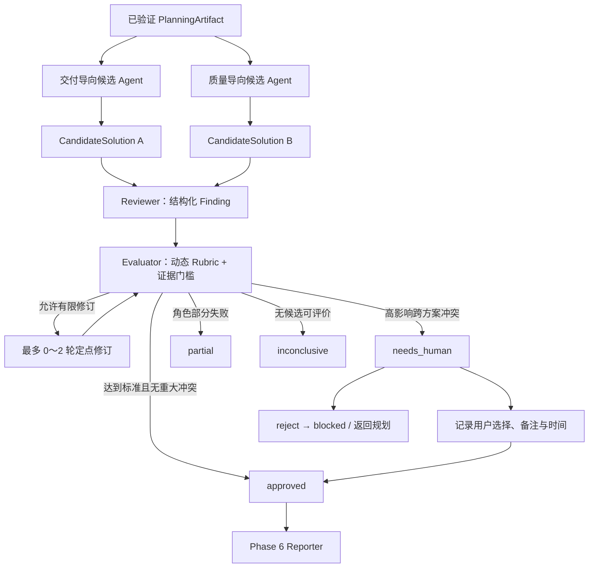

# Phase 5：候选方案、交叉评审与评价
<!-- 文件名：phase-5-cross-review-and-evaluation - 交叉评审与评价 -->
<!-- 所属目录：remediation - 工程整改实施 -->

阶段状态：部分完成（工程闭环已完成，真实模型与人工盲评对照实验尚未完成）  
开始与最后更新时间：2026-07-15 22:54（Asia/Shanghai）  
对应问题：REVIEW-1、REVIEW-2、P2-4

## 1. 先用白话说明结论

这一阶段已经把“让多个 Agent 讨论一下”改造成了一条可以检查、可以复现、可以追责的正式流程。

系统现在会先让两个候选角色分别提出方案：一个偏向快速、分阶段交付，另一个偏向质量门槛和长期可维护性。它们在生成自己的方案时看不到对方的答案，因此不容易一开始就互相模仿。随后 Reviewer 不能只说“这个方案不好”，而必须写清楚：哪里可能失败、严重程度、依据是什么、建议如何修改。Evaluator 再按动态评分维度检查候选和 Finding，而不是简单用多数投票决定。

如果系统发现“更快交付”和“更低长期风险”之间存在有依据的高影响冲突，它不会替用户偷偷作决定，而是暂停在 `needs_human`。用户选择交付优先、质量优先、混合方案或全部否决后，选择、备注和时间会永久保存在数据库中。相同请求可以安全重试，但第一次裁决之后不能再被不同选择覆盖。

必须诚实说明：当前已经证明的是流程契约、失败降级、权限隔离和持久化正确；尚未通过足够规模的真实模型与人工盲评证明“交叉评审一定比单 Agent 生成的报告更好”。因此 REVIEW-1、REVIEW-2 可以关闭，P2-4 只能标为部分完成。

## 2. 修改前的问题

修改前，设计文档提出了多候选、Reviewer 和 Evaluator，但运行代码还没有以下能力：

- 没有机器可读的候选方案契约，角色输出仍可能退化成自由聊天文本；
- 无法证明两个候选是独立生成的；
- 没有结构化 Finding，意见、证据和严重程度容易混在一起；
- 没有服务端证据门槛，模型可以把无依据的意见写成阻断项；
- 没有 Evaluator 的统一决策结构，也没有防止模型擅自替用户处理重大取舍；
- 没有有限修订轮次和跨角色失败终态；
- 没有 Review、人工裁决和来源计划之间的持久化关系；
- 没有 API 和账户隔离证据；
- 缺少一条可执行的匿名发卷、独立评分、解盲汇总链路，因而无法在真实模型实验中可靠地保存原始评分和避免评分者知道变体。

这些问题的共同风险是：界面看起来像“多 Agent 协作”，但无法回答“为什么采纳这个方案”“依据在哪里”“某个角色失败后结果还能不能相信”。

## 3. 本阶段边界

### 3.1 本阶段负责

- 两个方向不同、输入隔离的候选方案；
- Candidate、Finding、Review、Rubric、Evaluation 和人工裁决契约；
- Reviewer、Evaluator、证据门槛和重大冲突人工升级；
- 有限结构化重试、有限修订、Token/费用预算、Provider 超时和请求取消；
- 单角色失败时的 `partial`，全部候选失败时的 `inconclusive`；
- ReviewWorkflow 持久化、认证 API 和人工裁决审计；
- 确定性基线与真实模型两种执行模式；
- 自动化契约评估和真实质量实验方案的边界声明。

### 3.2 本阶段不负责

- 最终开发报告的章节合并、版本化 Artifact、导出和报告页面，这属于 Phase 6；
- 自动编写完整项目代码或自动部署，这不属于 AgentForge 产品边界；
- embedding/向量数据库升级；
- 宣称尚未做过的真实模型语义质量提升；
- 无限制讨论、无限修订或让模型静默决定业务重大取舍。

## 4. 修改后的完整流程



候选 A 与候选 B 使用同一个已验证计划，但候选生成函数只收到 `orientation + analysis + plan`。候选输入中不存在 `candidates` 字段，也不会收到另一个候选的输出。只有两个候选都完成后，Reviewer 才能同时查看它们。

## 5. 核心数据契约

### 5.1 CandidateSolution

每个候选必须包含：

| 字段 | 含义 | 约束价值 |
|---|---|---|
| `id` | 候选唯一标识 | 防止 Evaluator 引用不存在或重复的候选 |
| `orientation` | `delivery` 或 `quality` | 明确方案的优化方向 |
| `summary` | 方案摘要 | 给普通读者快速理解整体思路 |
| `decisions[]` | 关键决策 | 每项包含选择、理由、取舍和证据引用 |
| `implementationSteps[]` | 实施顺序 | 供最终报告转化为落地路线 |
| `risks[]` | 风险 | 避免只写优点 |
| `assumptions[]` | 假设 | 防止把未确认信息伪装成事实 |
| `estimatedEffort` | low/medium/high | 表达成本级别，而不是伪造精确工期 |

候选最少需要两项决策和两项实施步骤。模型输出必须通过 Zod/JSON Schema；默认最多尝试两次，连续无效就明确失败。

### 5.2 Finding

Reviewer 的每条 Finding 必须包含：

| 字段 | 白话解释 |
|---|---|
| `candidateId` | 这条问题针对哪个候选 |
| `severity` | blocking/high/medium/low |
| `category` | 权限、交付、可维护性、测试等类别 |
| `failureScenario` | 如果不处理，具体会怎样失败 |
| `evidenceRefs` | 可以检查的计划任务、章节或候选证据 |
| `suggestion` | 怎样修改，而不是只批评 |
| `relatedCandidateIds` | 该问题是否与另一个候选的取舍相关 |

服务端还会检查 Finding 引用的候选是否存在、Finding ID 是否重复、关联候选是否存在。只有 `evidenceRefs` 至少命中候选已有证据的 Finding，才进入 `supportedFindingIds`；其余统一进入 `ignoredFindingIds`。所以“我觉得不好”不能自动升级成阻断证据。

### 5.3 EvaluationResult

Evaluator 输出包括：

- `decision`：approved、needs_revision、blocked、needs_human 或 inconclusive；
- 每个候选在动态 Rubric 下的分数、理由和证据；
- 支持与忽略的 Finding ID；
- 选择的候选 ID；
- 未解决冲突、影响和可选项；
- 下一步动作。

Rubric 默认包含需求覆盖、技术可行性、成本与交付、可维护性、可测试性，并合并 Planner 产生的项目特有评价维度。Evaluator 不是投票器，候选数量多也不会自动占优。

## 6. 服务端不可绕过的安全规则

### 6.1 独立候选

两个候选并行调用，且候选函数的入参不包含另一个候选。模型可以相同，也可以使用不同 Agent；“独立”在这里表示上下文独立，而不是强制购买两个不同模型。

### 6.2 证据门槛

即使 Evaluator 把无证据 Finding 写入 `supportedFindingIds`，服务端仍会重新计算支持集合。模型声明不能覆盖服务器事实。

### 6.3 人工升级门槛

当以下条件同时成立时，服务端强制 `needs_human`：

1. 同时存在 delivery 与 quality 候选；
2. 存在 high/blocking Finding；
3. Finding 有可用证据；
4. Finding 明确关联另一个候选。

即使模型直接返回 `approved`，也会被这一规则改回 `needs_human`，并清空自动选择的候选。

### 6.4 有限循环与预算

- 候选数量：1～2；
- 结构化输出尝试：每个角色最多 2 次；
- 修订轮次：0～2，默认 1；
- Finding：默认最多 20，契约硬上限 40；
- 总 Token：默认 80,000；
- 总费用：默认 8 美元；
- Provider 调用沿用统一超时机制；
- 浏览器请求取消通过 `AbortSignal` 传到 Provider；
- 修订不得改变候选 ID 和 orientation。

模型调用前会预留预计 Token 和费用，调用完成后换成实际用量；无效 JSON 的调用也计入已消耗预算。这样“重试”不是免费的隐藏循环。

## 7. 失败语义

| 失败情况 | 返回状态 | 系统行为 |
|---|---|---|
| 一个候选失败 | `partial` | 保留成功候选，记录 `CANDIDATE_FAILED` |
| 两个候选都失败 | `inconclusive` | 不伪造候选，不再运行 Reviewer/Evaluator |
| Reviewer 失败 | `partial` | 使用空 Review 继续安全基线评价，记录 `REVIEW_FAILED` |
| Evaluator 失败 | `partial` | 使用确定性 Evaluator 回退并记录 `EVALUATOR_FAILED` |
| 修订失败 | `partial` | 保留修订前候选，停止循环，记录 `REVISION_FAILED` |
| 模型输出非法 | 对该角色有限重试后失败 | 不把自由文本当成合法结果 |
| 预算耗尽 | 角色失败或请求安全终止 | 不继续隐藏调用 |
| 高影响取舍 | `needs_human` | 不自动决定，等待持久化裁决 |

这里的 `partial` 不是“成功的另一种写法”。最终报告必须显示失败的角色和缺少的证据，不能把回退结果伪装成完整多 Agent 共识。

## 8. 人工裁决状态机

可选决策为：

- `approve_delivery`：选择交付导向候选；
- `approve_quality`：选择质量导向候选；
- `hybrid`：由 Reporter 合并安全/数据硬门槛和分阶段交付；
- `reject`：拒绝当前全部候选，回到规划阶段。

Review 创建为 `needs_human` 时，`approvalStatus=pending`。裁决后写入：

- `approvalStatus`：approved 或 rejected；
- `approvalDecision`；
- `approvalNote`；
- `decidedAt`；
- 更新后的 EvaluationResult。

完全相同的裁决请求是幂等的；第一次裁决完成后，不同决策返回 409，防止刷新、重放或并发请求覆盖已确认事实。审批接口使用 `userId` 查询，其他账户得到 404，看不到记录是否存在。

## 9. 持久化模型

新增 `ReviewWorkflow`，核心关联如下：

```text
User 1 ── N ReviewWorkflow N ── 1 PlanningArtifact
                         1 ── 1 Run
```

保存字段包括候选、Review、Evaluation、失败数组、预算快照、当前/最大修订轮次、人工裁决状态和 schemaVersion。所有复杂结构保存为带版本的 JSON 字符串，接口返回时恢复为对象。

新增 SQLite 迁移：`20260715203000_add_review_workflows`。全新隔离数据库已经证明 5 个迁移可以按顺序从空库完成。

## 10. API

### 10.1 `GET /api/reviews`

只返回当前认证用户最近 20 条审查记录。

### 10.2 `POST /api/reviews`

最小请求：

```json
{
  "planningArtifactId": "ready-plan-id"
}
```

这会运行可重复的 baseline 模式。真实模型模式需要明确提供角色：

```json
{
  "planningArtifactId": "ready-plan-id",
  "modelAgents": {
    "candidateAgentIds": ["delivery-agent-id", "quality-agent-id"],
    "reviewerAgentId": "reviewer-agent-id",
    "evaluatorAgentId": "evaluator-agent-id"
  },
  "budget": {
    "maxReviewRounds": 1,
    "maxTokens": 80000,
    "maxCostUsd": 8
  }
}
```

所有 Agent 必须属于当前用户。远程 Provider 没有凭证时明确报错，不使用模拟内容冒充成功。

### 10.3 `POST /api/reviews/:id/approval`

```json
{
  "decision": "hybrid",
  "note": "安全与数据一致性作为硬门槛，其余能力按风险分批交付。"
}
```

该接口只接受处于 pending 的当前用户 Review。

## 11. Baseline 与 Model 两种模式

Baseline 不是“假装模型已经工作”，而是用于开发、测试和离线演示的确定性参考实现。它固定表达两类合理取舍，便于验证状态机、权限、数据库和 UI 集成。

Model 模式调用用户配置的真实 Agent：候选、Reviewer、Evaluator 和修订都使用同一套 JSON Schema、有限重试、预算、超时和取消机制。接口响应通过 `mode` 明确标注 `baseline` 或 `model`，两者不会混淆。

## 12. 自动评估

新增确定性流程契约评估，使用 website、admin、learning 三类固定需求，指标如下：

| 指标 | 3 个样例聚合结果 | 能证明什么 |
|---|---:|---|
| 候选方向覆盖 | 1.0000 | 两种方向均产生 |
| 支持 Finding 的证据率 | 1.0000 | 支持项均带证据 |
| Evaluator 候选覆盖 | 1.0000 | 每个候选均被评分 |
| 决策可追踪性 | 1.0000 | 有理由和下一步 |
| 人工门槛准确性 | 1.0000 | 固定高影响冲突均升级 |
| 修订边界 | 1.0000 | 未超过最大轮次 |
| 失败披露 | 1.0000 | 降级结果不会隐藏失败 |

这些结果只证明流程契约符合预期。样本量为 3，且使用确定性 baseline，不能证明真实模型的语义质量，也不能证明 RAG 带来的质量增益。

### 12.1 已完成：盲评工具链与协议

已新增 [`docs/quality/blind-evaluation-protocol - 真实模型盲评协议.md`]()、`src/lib/review/blind-evaluation.ts` 和 `scripts/blind-evaluation.ts`。这套工具把公开给评分者的匿名材料包与仅供执行人保管的解盲表分离：报告包不含案例 ID、变体、运行 ID、Token、费用或延迟；解盲后才将分数与运行元数据合并。实验输入还必须冻结模型/Prompt/参数、RAG 知识快照、案例清单摘要和每次运行预算；评分表由不可逆 `packetId` 绑定到具体材料包，避免混入另一轮实验。

它会拒绝五种变体不齐、RAG 变体缺少知识快照、重复运行 ID、重复评分者、研究/材料包 ID 不匹配和漏评；正文或标题疑似泄露变体或案例身份时默认拒绝发卷。协议预注册最低 12 个案例、2 名独立评分者；低于门槛的汇总会明确写为“不可用于质量优势声明”。`blind-evaluation.test.ts` 验证匿名化、完整性校验、解盲汇总、材料包绑定与泄露拒绝，属于工具链验证，不是模型质量结果。

### 12.2 尚未完成的 P2-4 实验

正式质量实验必须固定同一组需求和评分说明，盲评以下变体：

1. 单 Agent；
2. 双候选但无交叉评审；
3. 双候选 + 同一版本知识库/RAG；
4. 双候选 + RAG + Reviewer/Evaluator；
5. 在第 4 项基础上加入人工裁决。

至少记录：需求覆盖、技术可行性、可测试性、证据正确性、人工修改量、延迟、Token 和费用。评审者不能提前知道报告来自哪个变体。达到预先定义的样本规模并保存原始评分后，才能关闭 P2-4。

## 13. 验证证据

本阶段完成后的实际结果：

| 检查 | 结果 |
|---|---|
| TypeScript `npx tsc --noEmit` | 通过 |
| Review/API 定向 ESLint | 通过 |
| 单元测试 | 62/62 通过 |
| 核心 E2E | 24/24 通过 |
| Session 隔离 E2E | 1/1 通过 |
| SQLite 迁移 | 8/8 从空库应用成功 |
| PostgreSQL schema | 校验通过 |

新增单元证据覆盖：

- 候选输入独立；
- 无证据 Finding 不阻断；
- 单候选失败返回 partial；
- 修订达到上限即停止；
- Reviewer 失败明确披露；
- Evaluator 失败明确披露；
- Evaluator 不能绕过人工门槛；
- 三类固定需求的契约指标。
- 匿名材料包不泄露案例或变体；完整评分后才允许解盲汇总；漏评会被拒绝。

新增 E2E 证据覆盖：

- 计划 → 双候选 → Finding → needs_human → hybrid 裁决 → 持久化；
- 相同裁决重试幂等，不同裁决不能覆盖；
- 两个模型候选各自最多重试两次，全部失败返回 inconclusive；
- 用户 B 不能审批用户 A 的 Review。

## 14. 验收结论

- [x] 两个候选可以解释速度与质量取舍；
- [x] 候选生成上下文相互隔离；
- [x] 无证据 Finding 不自动阻断；
- [x] 单角色失败输出 partial/inconclusive，不伪造成完整成功；
- [x] 修订、结构化重试、Token、费用、Provider 超时和取消均有边界；
- [x] 高影响冲突进入可审计的人工确认；
- [x] Review 和裁决按 userId、Plan、Run 持久化；
- [x] 有 3 类固定样例的流程契约评估；
- [x] 有预注册门槛、匿名评分包、私有解盲表和自动汇总的真实盲评工具链；
- [ ] 完成单 Agent、双 Agent、双 Agent + RAG、交叉评审的真实模型盲评；
- [ ] 得到足够样本的质量、人工修改量、延迟、Token 和费用结论。

因此本阶段工程闭环完成，REVIEW-1 与 REVIEW-2 标记为已完成；P2-4 标记为部分完成，Phase 5 总状态保持“部分完成”。

## 15. 主要文件

- `src/lib/review/contracts.ts`：全部机器可读契约；
- `src/lib/review/review-service.ts`：候选、Reviewer、Evaluator、修订与失败状态机；
- `src/lib/review/model-generators.ts`：真实模型、预算、有限重试和用量归集；
- `src/lib/review/prompts.ts`：按角色拆分的 JSON Schema Prompt；
- `src/lib/review/prisma-review.ts`：Review 和人工裁决持久化；
- `src/lib/review/evaluation.ts`：流程契约评估；
- `src/lib/review/blind-evaluation.ts`、`scripts/blind-evaluation.ts`：盲评匿名化、评分完整性校验、解盲与汇总；
- `docs/quality/blind-evaluation-protocol - 真实模型盲评协议.md`：真实模型盲评协议和结论边界；
- `src/app/api/reviews/route.ts`：创建和查询 Review；
- `src/app/api/reviews/[id]/approval/route.ts`：人工裁决；
- `prisma/migrations/20260715203000_add_review_workflows/migration.sql`：数据库迁移；
- `e2e/core.spec.ts`、`e2e/session-isolation.spec.ts`：完整链路和账户隔离证据。

## 16. 下一步顺序

1. Phase 6 先定义 ReportArtifact、章节、来源和版本契约；
2. Reporter 读取 PlanningArtifact、ReviewWorkflow 和人工裁决，不重新猜测已确认事实；
3. 对 `partial`/`inconclusive` 报告显示明显警告和缺失角色；
4. 根据动态 ReportSection 生成不同项目的章节，而不是套固定模板；
5. 建立报告列表、详情、证据侧栏和导出；
6. 按盲评协议运行固定真实模型实验、冻结独立评分并解盲汇总，补齐 P2-4；
7. Phase 7前端拆分、全量 lint、构建和Web交付边界现已完成；真实模型盲评仍回到本阶段P2-4继续执行。
