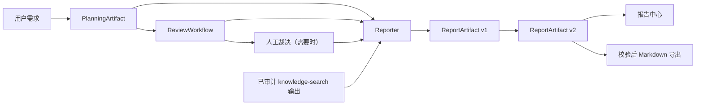

# Phase 6：Artifact、动态报告与产品页面
<!-- 文件名：phase-6-dynamic-report-and-ui - 动态报告与产品界面 -->
<!-- 所属目录：remediation - 工程整改实施 -->

阶段状态：已完成（REPORT-1、REPORT-2、REPORT-3，3/3）  
最后更新：2026-07-15 22:04（Asia/Shanghai）  
对应问题：REPORT-1、REPORT-2、REPORT-3

## 1. 白话结论

系统现在不只是“生成一段报告文字”，而是会创建一份有版本、有来源、有状态、可以追溯到计划和评审的正式 ReportArtifact。

官网、管理后台和学习工具会沿用 Planner 各自生成的目录，不会强制套用同一份固定模板。正文中的每条事实、建议、风险、取舍、假设或待确认项都必须带来源。来源可以是需求、计划任务、候选方案、Finding、Evaluator、人工裁决，或者确实由知识 Tool 返回并经过校验的文档引用。模型不能凭空发明一个知识来源。

报告生成前如果还有待处理的重大人工决定，接口会拒绝继续。报告生成后不会覆盖旧版本：第一次是 v1，下一次是 v2，并保存父版本关系。相同 `generationKey` 的网络重试只返回已经生成的版本，不会重复调用模型、重复收费或重复入库。

产品新增独立的“动态开发报告中心”。普通用户可以看到报告状态、动态目录、最终决策、风险、未决事项、来源清单和历史版本，也可以导出经过再次校验的 Markdown。

REPORT-3也已完成：`/workflows` 将 Planner、双候选、Reviewer、Evaluator、人工确认和 Reporter 合并到同一个产品级 LangGraph；缺失信息和高影响取舍可通过持久 Checkpoint 暂停、恢复，异常失败还可以在租约和乐观锁保护下继续。baseline和model共用同一状态图，完整Checkpoint不会发送到浏览器。详细设计、恢复语义、失败实验和测试证据见[产品工作流与Checkpoint技术专题](phase-6-workflow-checkpoint-completion - 工作流与Checkpoint恢复.md)。

## 2. 修改前风险

Phase 5 已经有 PlanningArtifact 和 ReviewWorkflow，但仍缺少最终产品产物：

- 报告没有独立数据模型，刷新后只能依靠临时文本；
- 再次生成可能覆盖旧结果，无法比较版本；
- 报告章节可能脱离 Planner 动态目录；
- 结论没有机器可验证的来源；
- 模型可能发明知识引用；
- pending 人工冲突可能被 Reporter 跳过；
- `partial`、`blocked`、`inconclusive` 容易被写成普通成功报告；
- 网络重试可能重复生成、重复计费；
- 导出可能包含疑似密钥、原始错误或失效引用；
- 报告仍混在工作台对话中，普通用户难以阅读。

## 3. 当前数据链



Reporter 不重新分析用户是否已经确认某项取舍，而是读取已保存的事实链。这样人工裁决不会在最后一步被模型“忘记”或改写。

## 4. DevelopmentReport 契约

### 4.1 顶层字段

| 字段 | 说明 |
|---|---|
| `schemaVersion` | 当前固定为1，未来不兼容升级必须改版本 |
| `title` | 报告标题 |
| `status` | completed、partial、blocked、inconclusive |
| `executiveSummary` | 给非技术读者的执行摘要 |
| `decisionSummary` | 最终候选/混合/拒绝决定及影响 |
| `sections[]` | 严格来自 Planner 的动态章节 |
| `assumptions[]` | 明确标注的假设 |
| `risks[]` | 需求风险和高优先级 Finding |
| `unresolvedItems[]` | 未决冲突和失败角色 |
| `sourceManifest[]` | 全报告去重后的来源清单及使用位置 |

### 4.2 Chapter

每章包含 Planner 章节 ID、标题、顺序、目的、摘要、正文 Markdown 和结构化 Claims。章节数量限制为3～20；章节 ID 和顺序必须与来源计划完全一致。

### 4.3 Claim

每条 Claim 包含：

- `kind`：fact、assumption、recommendation、risk、tradeoff、open_question；
- `statement`：面向读者的结论；
- `confidence`：high、medium、low；
- `sourceRefs[]`：至少一条可验证来源。

这比“在文末放几个参考链接”更严格：系统知道具体哪一条结论使用了哪一项来源。

## 5. 来源解析与反伪造

来源类型包括：

| 类型 | 合法 ID 的来源 |
|---|---|
| `requirement` | 当前 PlanningArtifact ID |
| `plan_task` | 当前 ExecutionPlan 任务 ID |
| `report_section` | 当前 Planner 章节 ID |
| `candidate` | 当前 ReviewWorkflow 候选 ID |
| `finding` | 当前 ReviewResult Finding ID |
| `evaluation` | 当前 ReviewWorkflow ID |
| `human_decision` | 已经保存人工裁决的 ReviewWorkflow ID |
| `knowledge` | 当前计划 Run 中成功的 knowledge-search 审计输出 |

知识来源不是看到 `sourceType=knowledge` 就放行。服务端会读取 `ToolInvocation.outputJson`，恢复 documentId、SHA-256、标题路径、版本、许可和真实行号，并组成允许列表。Reporter 输出的知识 `refId` 必须命中该列表，否则出现 `REPORT_SOURCE_INVALID`。

旧的、损坏的 Tool 输出不会让报告生成崩溃，而是被跳过；它们也不能成为合法来源。

## 6. 动态目录校验

Reporter 必须使用 Planner 的章节 ID，且排序后与 `ExecutionPlan.reportSections` 完全一致。以下情况会拒绝保存：

- 少一章；
- 多一章；
- 把后台项目替换成固定“官网 SEO”模板；
- 章节 ID 重复；
- Claim ID 重复；
- 来源不存在；
- sourceManifest 漏掉正文使用的来源；
- 报告状态与 ReviewWorkflow 状态不一致；
- 检测到疑似 API Key、密码或私钥。

## 7. 报告状态映射

| Review 状态 | Report 状态 | 展示要求 |
|---|---|---|
| approved | completed | 展示最终决定、风险和来源 |
| partial | partial | 明显列出失败角色，不称为完整共识 |
| blocked/rejected | blocked | 只输出阻塞原因和重新规划要求 |
| inconclusive | inconclusive | 说明为何无法裁决，不伪造候选 |
| needs_human/pending | 不生成 | 返回409，等待用户决定 |

## 8. Baseline 和真实 Reporter

### 8.1 Baseline

确定性 Reporter 用于离线运行、回归测试和演示。它按章节关联计划任务、候选决策和 Finding，生成带 `[source:type:id]` 标记的正文，并把假设、风险、失败和人工决定分别归类。

### 8.2 Model

请求传入 `reporterAgentId` 时使用当前用户的真实 Agent。服务端要求：

- Agent 必须属于当前用户；
- 非 Ollama Provider 必须有有效凭证；
- 输出严格通过 DevelopmentReport JSON Schema；
- 最多两次结构化尝试；
- 默认最多60,000 Token、5美元；
- 统一 Provider 超时和 AbortSignal；
- 调用前若源数据含疑似凭证，直接阻断，不发送给模型；
- 模型输出还要经过动态章节、来源、状态和敏感信息二次校验。

即使两次输出都被拒绝，实际 Token 和费用仍写入 Run/TokenUsage，错误结果不会伪装成 ReportArtifact。

## 9. ReportArtifact 与版本链

新增字段包括：

- 来源 `planningArtifactId`、`reviewWorkflowId`；
- 独立生成 `runId`；
- `version` 和 `parentReportId`；
- `generationKey`；
- status、title、executiveSummary；
- 完整 `contentJson`；
- 可独立查询的 `sourceManifestJson`；
- schemaVersion、createdAt、updatedAt。

同一个 Review 的版本号具有唯一约束；同一用户的非空 generationKey 也具有唯一约束。

新增迁移：

1. `20260715213000_add_report_artifacts`；
2. `20260715214500_add_report_generation_idempotency`。

当前共有9次 SQLite migration，可从空数据库依次执行；旧初始版开发库会先创建带时间戳备份，再登记初始 migration并应用后续迁移。

## 10. 幂等和恢复语义

创建报告必须提供客户端生成的 `generationKey`：

```json
{
  "reviewWorkflowId": "review-id",
  "generationKey": "client-request-uuid"
}
```

- 第一次成功：返回201和新 Artifact；
- 同一个用户、同一个 Review、同一个 generationKey 重试：返回200、`mode=replay`、原 Artifact；
- 同一个 key 被用于另一个 Review：返回409；
- 使用新 key：明确创建下一版本。

报告页刷新只执行 GET，不会触发 POST，因此不会产生新版本。该机制解决成功响应在网络中丢失后客户端重试的重复副作用问题。

## 11. API

### 11.1 `GET /api/reports`

返回当前用户最近20个 ReportArtifact。

### 11.2 `POST /api/reports`

Baseline 示例：

```json
{
  "reviewWorkflowId": "review-id",
  "generationKey": "c7d93b4b-..."
}
```

Model 示例：

```json
{
  "reviewWorkflowId": "review-id",
  "generationKey": "c7d93b4b-...",
  "reporterAgentId": "agent-id",
  "budget": {
    "maxTokens": 60000,
    "maxCostUsd": 5
  }
}
```

### 11.3 `GET /api/reports/:id`

只读取当前用户拥有的报告。其他用户返回404。

### 11.4 `GET /api/reports/:id/export`

再次加载来源链并完整校验后返回 `text/markdown; charset=utf-8`，同时设置 attachment 和 `nosniff`。其他用户不能探测或导出报告。

## 12. 报告中心

新增 `/reports` 独立页面，并从工作台右上角提供入口。页面采用三栏布局：

1. 左侧：报告历史、状态、版本和“从评审生成新版本”；
2. 中间：执行摘要、最终决策、动态章节、风险、假设和未决项；
3. 右侧：动态目录与来源清单。

正文不直接渲染未经处理的模型 HTML，而是把结构化 Claim 当普通文本展示，降低脚本注入风险。页面在窄屏下会改为纵向布局。

状态使用“已完成、部分完成、已阻塞、不可裁决”，不只靠颜色表达。来源显示类型、ID、标签和引用次数。

## 13. 自动验证

| 检查 | 当前结果 |
|---|---|
| TypeScript | 通过 |
| Report/API/UI 定向 ESLint | 通过 |
| 单元测试 | 62/62 |
| 核心 E2E | 24/24 |
| Session 隔离 E2E | 1/1 |
| SQLite 空库迁移 | 9/9 |
| PostgreSQL schema | 通过 |

单元测试新增证明：

- website、admin、learning 报告目录互不相同且匹配 Planner；
- 每条 Claim 都能通过 sourceManifest 解析；
- partial Review 生成明确 partial 报告并披露失败；
- 疑似密钥阻止保存/导出；
- 模型不能发明知识引用。

核心 E2E 新增证明：

- pending 人工决定不能提前生成；
- v1、v2 和 parentReportId 正确；
- 相同 generationKey 返回原 v1，不新建版本；
- Markdown 导出包含版本、动态章节和来源；
- Reporter 连续两次非法 JSON 时不保存 Artifact；
- 报告中心可见动态目录、最终决策、来源和导出入口。

Session E2E 新增证明：

- 用户 B 看不到用户 A 的报告列表；
- 用户 B 读取详情和导出均返回404；
- 用户 A 切回后仍能读取自己的 Artifact。

### 2026-07-16：任务对话空间前端收口

- 聊天页不再默认使用内部 `manual-run-*` 临时空间，而是读取用户可见的持久 `Workspace`；内部兼容记录不会出现在任务空间列表；
- 用户可创建或编辑“任务名称 + 任务说明 + 智能体成员”的对话空间，切换空间会切换独立的消息、费用和运行状态；
- 若当前账号已有“需求分析师”和“开发报告负责人”，前端首次加载会建立默认的“开发报告生成”空间，并按该顺序绑定两者；
- 发送改走 `/api/workspaces/:id/run`，因此消息、Run、TokenUsage 和 `activeRunId` 锁均归属当前任务空间；清空消息不会删除空间或成员；
- 能力库不再提供会误导用户的“全局 RAG 开关”：文档是账号共享知识库，只有绑定 `RAG Retrieval` 的智能体会在各自空间运行前检索文档。

## 14. 已知限制

- 对话、工作流和报告已经分为独立页面；更细的节点详情页当前没有必要；
- 还没有 PDF/DOCX 导出，当前正式导出格式为可审计 Markdown；
- Checkpoint当前使用本地SQLite，尚未验证共享Checkpointer和多实例部署；
- 已持久化节点可幂等回放；Provider已经计费但响应/Artifact尚未落库时发生进程崩溃，仍有结果未知窗口，严格费用exactly-once需Provider幂等键或ModelCall账本；
- ReportArtifact 是完整快照，没有做章节级增量存储；
- Model Reporter已有受控协议桩完整成功E2E和非法输出E2E，但尚未用多个外部真实模型做内容质量盲评；
- 知识引用只接受当前来源计划 Run 已审计的 Tool 输出，Review Run 中未来新增的知识调用还需扩展来源聚合；
- UI 尚未完成键盘、屏幕阅读器和多尺寸专项人工验收；
- 多实例并发仍需 PostgreSQL 和部署环境验证。

## 15. 验收结论

- [x] 刷新不会重复执行报告生成副作用；
- [x] 相同 generationKey 不重复收费或入库；
- [x] 报告目录随 fixture 变化且结构合法；
- [x] UI 能解释状态、章节、来源、风险和人工决定；
- [x] 导出不包含密钥、原始内部错误或 checkpoint；
- [x] 报告区分 completed、partial、blocked 和 inconclusive；
- [x] ReportArtifact、Review 和来源关系可追踪；
- [x] 完成独立工作流节点页、暂停和恢复；
- [x] 完成 Checkpoint 幂等恢复验证；
- [x] 明确当前正式导出为Markdown，PDF/DOCX作为后续可选范围。

REPORT-1、REPORT-2、REPORT-3均标记为已完成。Phase 6 总状态为“已完成（3/3）”。

## 16. 主要文件

- `src/lib/report/contracts.ts`：DevelopmentReport、Chapter、Claim、Source、Budget契约；
- `src/lib/report/report-service.ts`：baseline、动态校验、敏感扫描和 Markdown 渲染；
- `src/lib/report/model-generator.ts`：真实 Reporter、有限重试、预算和用量；
- `src/lib/report/prisma-report.ts`：来源加载、知识审计解析、版本化保存；
- `src/app/api/reports/`：列表、生成、详情和导出；
- `src/components/reports/report-center.tsx`：独立报告中心；
- `src/lib/workflow/`：产品图、Checkpoint、Prisma适配、幂等和恢复；
- `src/app/api/workflows/`：工作流列表、创建、详情、resume和recover；
- `src/components/workflows/workflow-center.tsx`：七节点工作流页面与模型角色配置；
- `prisma/schema.prisma`、`schema.postgres.prisma`：ReportArtifact关系；
- `e2e/core.spec.ts`、`session-isolation.spec.ts`：生成、版本、UI和隔离证据。

## 17. 下一步顺序

1. 执行真实模型报告盲评，补齐 Phase 5 的 P2-4；
2. 扩大RAG固定语料和查询集；
3. 按部署目标决定共享Checkpointer、PostgreSQL migration history和租约心跳；
4. 决定PDF/DOCX是否进入下一交付版本；
5. 完成可访问性与多尺寸人工验收；
6. 由项目所有者确认历史密钥与Secrets已经在外部完成轮换。
